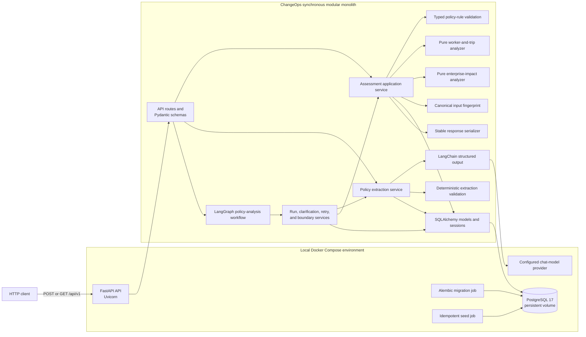
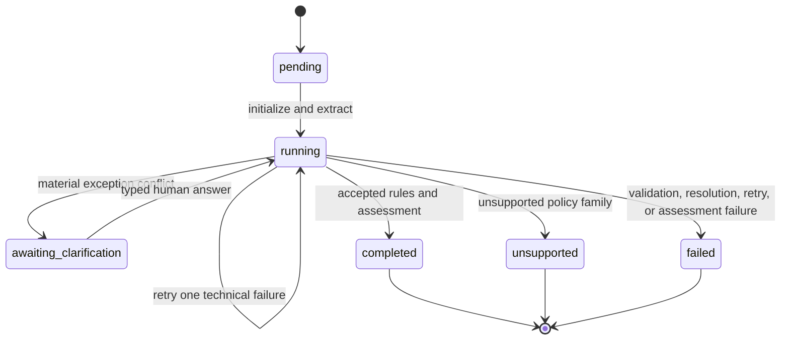
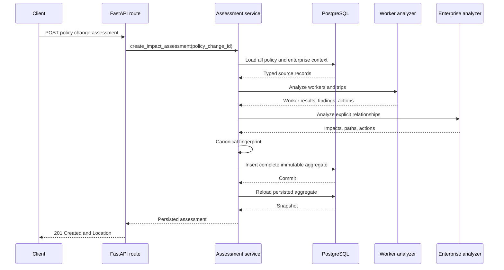
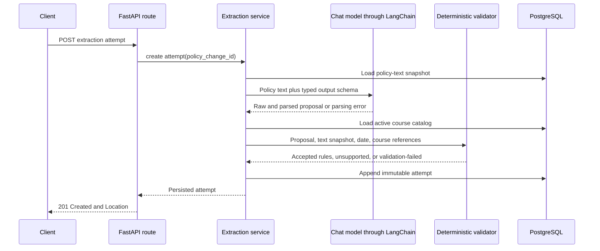

# ChangeOps Architecture

This document describes the current implementation: Milestone 1 plus the first three Milestone 2
vertical slices for structured extraction, durable policy-analysis orchestration, and grounded
post-assessment interpretation.

## High-level architecture

ChangeOps remains a synchronous modular monolith. The HTTP, application, domain, serialization, and
persistence code run in one Python process. PostgreSQL stores source, extraction, and assessment
data; a configured OpenAI chat model is the only external service used by the extraction endpoint.

## Major runtime components

### API

The FastAPI application exposes:

- `GET /healthz`
- `POST /api/v1/policy-changes/{policy_change_id}/impact-assessments`
- `GET /api/v1/impact-assessments/{assessment_id}`
- `POST /api/v1/policy-changes/{policy_change_id}/extraction-attempts`
- `GET /api/v1/policy-extraction-attempts/{attempt_id}`
- `POST /api/v1/policy-analysis-runs`
- `GET /api/v1/policy-analysis-runs/{run_id}`
- `POST /api/v1/policy-analysis-runs/{run_id}/clarifications/{clarification_id}/answer`
- `POST /api/v1/impact-assessments/{assessment_id}/change-plans`
- `GET /api/v1/impact-assessments/{assessment_id}/change-plan`
- `GET /api/v1/change-plans/{change_plan_id}`
- `GET /api/v1/policy-interpretation-attempts/{attempt_id}`

The create response adds an input fingerprint, enterprise-impact summary, and categorized
enterprise impacts. Existing worker results, findings, evidence, proposed actions, and unresolved
questions remain available.

Pydantic constrains impact domains, object types, classifications, and action types. It also
validates allowed domain-classification combinations.

### Policy extraction service

The extraction endpoint loads only the policy text, effective date, and organization identifier
before invoking the model. LangChain binds a strict Pydantic output schema with
`with_structured_output(..., include_raw=True)`. The prompt contains policy text and the supported
schema boundary; it never contains workers, trips, completions, teams, dependencies, commitments,
existing impacts, or enterprise identifiers.

Model output is proposed data. A pure deterministic validator:

1. validates the structured schema and closed literals;
2. resolves each exact quoted passage to the nearest matching zero-based span in the stored policy
   snapshot, then rejects quotes that do not resolve;
3. checks supported family and version-1 business invariants;
4. verifies the extracted effective date against the policy record;
5. resolves the human-readable training-course name to exactly one active organization course;
6. constructs `InternationalTravelPolicyRules` only after every check passes.

The model never receives or proposes `training_courses.id`. Unsupported families and
unrepresentable constructs terminate with an explicit unsupported outcome. Parsing, grounding,
business-rule, and reference failures terminate with validation-failed. Neither outcome reaches the
assessment service.

### Assessment application service

The assessment service coordinates one synchronous transaction:

1. Load the policy and every organization record that can influence impact discovery.
2. Validate `policy_changes.structured_rules` as `InternationalTravelPolicyRules`.
3. Convert SQLAlchemy records to immutable domain input.
4. Run the existing pure worker-and-trip analyzer.
5. Run the pure enterprise-impact analyzer using the worker result and loaded context.
6. Calculate a SHA-256 fingerprint from canonicalized policy, source, dependency, and question
   input.
7. Persist the complete assessment aggregate.
8. Commit once, then reload the aggregate with explicit eager loading.

Any exception before commit rolls back the assessment, workers results, findings, evidence,
enterprise impacts, paths, actions, and copied questions.

The existing endpoint still validates `policy_changes.structured_rules`. A narrow second entry
point accepts an already validated `InternationalTravelPolicyRules` value from the workflow
boundary. It uses the same loaders, analyzers, fingerprinting, and persistence functions, so the
Milestone 1 engine is unchanged.

### Policy-analysis workflow

LangGraph coordinates explicit nodes; application and domain services make all decisions. Graph
state contains only the run, attempt, clarification, and assessment identifiers plus routing
fields. It does not contain policy text, raw model output, or enterprise records.

PostgreSQL is authoritative. Starting or resuming reconstructs routing from the run, latest
attempt, and clarification rows; no in-memory workflow object or opaque graph checkpoint is needed.
Terminal runs do not execute again.

The deterministic materiality gate asks only
`booking_before_effective_date_exemption` in schema v1. Because the existing deterministic rule
model requires `booking_before_effective_date_is_exempt: Literal[True]`, this is explicitly a
`true` acknowledgement contract rather than an unrestricted boolean question. A `false` request
is rejected and leaves the clarification pending. The gate does not ask humans to repair malformed
output, identify unsupported policy families, or resolve arbitrary free-form questions.
`non_material_ambiguity` findings do not pause when all required fields validate. Course-name
resolution failures terminate with `enterprise_reference_unresolved`.

Malformed output and provider invocation failures receive at most one new extraction attempt.
Unsupported output, deterministic invariant failures, and enterprise-reference failures are not
blindly retried. Exhaustion terminates with `retry_limit_exhausted`.

Before provider invocation, the durable run moves to `running / extract`; it therefore remains
observable while the synchronous HTTP request is open. Provider construction applies explicit
timeouts and disables provider-library retries so the workflow remains the single owner of its
bounded retry policy. Start/completion logs include provider/model identifiers, elapsed time, parse
success, and a sanitized error category without policy text or raw provider output.

The assessment adapter reloads the persisted attempt, requires `accepted`, validates its typed
rules again, rejects pending clarification, and then calls the deterministic assessment service.
A unique nullable `impact_assessments.policy_analysis_run_id` prevents duplicate assessments.

### Coverage-gap interpretation

Interpretation is an explicit synchronous operation after a policy-analysis run has completed and
its immutable assessment exists. Deterministic application code eagerly loads that assessment
aggregate, the accepted extraction attempt, stored policy-text snapshot, accepted provenance,
answered clarifications, actions, and unresolved questions. It builds a stable, bounded DTO before
calling LangChain structured output. The interpreter receives no SQLAlchemy session, repository,
tools, ORM records, or raw enterprise source tables.

The interpreter uses LangChain's `function_calling` structured-output method over OpenAI's
Responses API because its nested Pydantic schema is outside OpenAI's stricter native JSON-schema
subset and reasoning-enabled function tools are unsupported by the Chat Completions API.
Start/completion logs record the run, assessment, provider/model identifiers, elapsed time, parse
success, and a sanitized error category without persisted input or raw provider output.

The candidate schema permits only review concerns with typed policy-span, impact, evidence, and
relationship-path references. It structurally forbids impact mutations and asserted enterprise
facts. Exact policy quotes are deterministically resolved to the nearest matching zero-based span
before a pure validator resolves all references against the input; quotes absent from the stored
policy remain invalid. The validator also accepts an empty gap list. Accepted output is stored as a
separate immutable JSON aggregate; it does not own or duplicate impacts.

Every invocation produces an append-only `policy_interpretation_attempts` row containing provider,
model, prompt/schema versions, raw and candidate output, validation errors, and a stable failure
code. `change_plans` has a unique assessment foreign key, enforcing one accepted plan per
assessment. Repeated creation returns that plan. Invalid/provider-failed attempts do not block a
later retry. Provider construction is lazy, so returning an existing plan does not require provider
configuration. Composite foreign keys require every plan's run, assessment, and accepted attempt
to belong to the same lifecycle. PostgreSQL triggers reject attempt and plan updates or deletes.

Interpretation errors are isolated after assessment completion. They never change the
policy-analysis run from `completed`, roll back the assessment, or affect assessment retrieval.
Product UI, approval, prioritization, action sequencing/execution, RAG, tools, and additional policy
families remain deferred.

### Deterministic analyzers

Both analyzers are pure Python. They do not import FastAPI or SQLAlchemy, perform database or
network I/O, or mutate input.

The Milestone 0 analyzer continues to evaluate:

- worker and trip scope;
- policy effective date;
- booking-date approval exception;
- security-training completion.

The Milestone 1 analyzer deterministically derives:

- directly affected workers;
- operationally affected managers and teams;
- systems connected to changed approval or training rules;
- documents connected through explicit policy dependencies;
- the policy-required course and worker-specific incomplete-training impacts;
- customer commitments with a required assigned worker and inclusive trip-date overlap.

It returns immutable impacts, stable reason codes, evidence keys, ordered path elements, and
unexecuted action proposals. Domain ordering is fixed as people, teams, systems, documents,
training, and customer commitments.

### Input fingerprint

The canonical fingerprint includes:

- analyzer version and complete typed policy input;
- workers and managers;
- worker-team memberships and teams;
- trips;
- courses and completion records;
- systems, documents, and all typed policy dependencies;
- customer commitments and assignments;
- unresolved questions.

Every source collection is sorted by stable semantic identifier before canonical JSON encoding.
Database row order does not affect the fingerprint; a relevant field change does.

### Response serializer

The serializer reads only the persisted assessment snapshot. It:

- sorts worker results, findings, evidence, impacts, actions, and questions by semantic keys;
- preserves persisted path sequence;
- groups impacts into six explicit domain collections;
- calculates summary counts from the returned persisted records;
- links action identifiers to their enterprise impacts;
- always serializes action execution as `not_executed`.

It does not query mutable source tables.

## Request and persistence flow

Retrieval loads the aggregate with `selectinload` and serializes it with the same stable ordering.
There are no assessment update or delete endpoints.

Policy extraction is a separate synchronous flow:

## Persistence model

### Source data

Milestone 0 source tables remain:

- `organizations`
- `workers`
- `trips`
- `training_records`
- `policy_changes`
- `policy_change_questions`

Milestone 1 adds:

- `teams`
- `worker_team_memberships`
- `enterprise_systems`
- `enterprise_documents`
- `training_courses`
- `customer_commitments`
- `commitment_assignments`
- `policy_system_dependencies`
- `policy_document_dependencies`
- `policy_training_dependencies`

Managers use stable worker records referenced by `workers.manager_worker_id`. A narrow membership
table gives each demonstration worker one current team. Separate dependency tables preserve real
foreign keys to systems, documents, and courses; there is no polymorphic graph target.

`training_records.course_identifier` now references `training_courses.id`.

### Append-only extraction attempts

`policy_extraction_attempts` stores the policy-text snapshot, raw and parsed model output, candidate
and accepted rules, provenance, findings, validation errors, and provider/model/prompt/schema
versions. Every POST inserts a new UUID row. A PostgreSQL trigger rejects updates and deletes so
failed and superseded attempts remain inspectable. Workflow attempts additionally reference their
run and record a retry or human-clarification derivation reason.

### Durable workflow records

`policy_analysis_runs` stores the immutable policy snapshot, closed status and step, latest
attempt, assessment, retry count, stable failure information, versions, accepted-rule provenance,
and timestamps. `policy_analysis_clarifications` stores an immutable question/code/answer contract,
affected fields, status, typed answer, responder, explicit human provenance, and timestamps.
Question-defining columns are protected from update by a PostgreSQL trigger.

Clarification answers are written once under row locks. Duplicate or concurrent answers conflict.
The original question is never replaced, and human facts never receive fabricated policy-text
spans.

This synchronous slice assumes one active workflow executor per run. Row locks serialize
clarification answers and run-state attachment, and the unique assessment association makes
assessment recovery idempotent, but extraction invocation is not protected by a lease held across
the provider call. Concurrent executors could therefore create multiple append-only attempts and
race to set the latest attempt. A future asynchronous-worker slice should add a guarded execution
token or compare-and-set transition before supporting multiple executors; this PR intentionally
does not introduce distributed locks or a queue.

### Immutable assessment aggregate

The Milestone 0 snapshot tables remain:

- `impact_assessments`
- `assessment_worker_results`
- `findings`
- `evidence`
- `finding_evidence`
- `proposed_actions`
- `assessment_unresolved_questions`

Milestone 1 adds:

- `assessment_enterprise_impacts`
- `assessment_impact_evidence`
- `assessment_impact_path_elements`

Enterprise impacts store domain, object type, stable source key, display name, classification,
explanation, reason code, and sort key in relational columns. Evidence remains a narrowly scoped
JSONB source snapshot linked through join tables. Relationship paths are ordered rows containing
object type, stable key, display label, and relationship to the next element.

`proposed_actions` may reference a finding, an enterprise impact, or both. A database check requires
at least one parent, and the existing `execution_status = 'not_executed'` constraint remains.

Assessment immutability is an application invariant:

- each analysis creates a new aggregate;
- source changes never update prior snapshots;
- the API exposes no assessment mutation;
- all aggregate rows commit atomically.

## Seeded demonstration

The idempotent seed contains:

- six travelers and six manager worker records;
- four teams and six memberships;
- three systems, one unaffected;
- four documents, one unaffected;
- one explicit International Travel Security course;
- six completion records;
- typed policy dependencies for two systems, three documents, and the course;
- two customer commitments and assignments, one affected by date overlap.

The completed golden assessment returns:

- three affected and three unaffected traveler results;
- six Milestone 0 findings;
- 18 enterprise impacts across all six domains;
- 13 proposed actions, all unexecuted;
- eight copied unresolved questions.

## External dependencies and boundaries

The assessment endpoints communicate only with PostgreSQL. Extraction and policy-analysis create
or retry operations additionally use LangChain Core and the configured `langchain-openai` chat
model integration. LangGraph 1.0.8 provides the narrow orchestration runtime.

There are no:

- agents, tool-calling loops, embeddings, RAG, or vector-search components;
- MCP or live enterprise integrations;
- graph databases;
- background workers or message queues;
- approval workflows or action execution;
- frontend, authentication, or authorization components.

## Technology stack

### Runtime

- Python 3.12
- FastAPI 0.141.1
- Uvicorn 0.52.0
- Pydantic Settings 2.14.2
- LangChain Core 1.5.3
- LangChain OpenAI 1.4.1
- LangGraph 1.0.8
- SQLAlchemy 2.0.51
- Psycopg 3.3.4
- Alembic 1.18.5
- PostgreSQL 17
- Docker Compose

### Development and testing

- pytest 9.1.1
- httpx2 2.9.1 through FastAPI `TestClient`
- Ruff 0.16.1
- a dedicated PostgreSQL `changeops_test` database created and removed by the integration fixture
