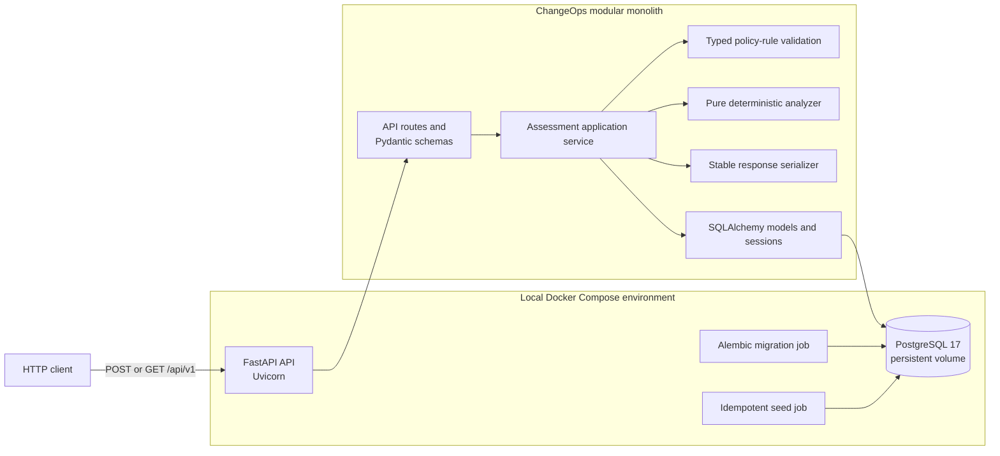
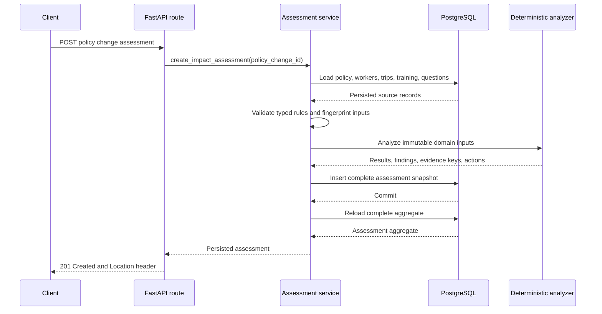

# ChangeOps Architecture

This document describes the current Milestone 0 implementation.

## High-level architecture

ChangeOps is a synchronous modular monolith. The HTTP, application-service, domain-analysis, serialization, and persistence code run in one Python process. PostgreSQL is the only separate application runtime.

## Major runtime components

### API

The `api` Compose service runs Uvicorn with the FastAPI application. It exposes:

- `GET /healthz`
- `POST /api/v1/policy-changes/{policy_change_id}/impact-assessments`
- `GET /api/v1/impact-assessments/{assessment_id}`

FastAPI route handlers translate HTTP input and application exceptions. Pydantic response models define the public representation.

### Assessment application service

The assessment service coordinates one synchronous analysis transaction:

1. Load a policy change and its organization data.
2. Validate `policy_changes.structured_rules` as `InternationalTravelPolicyRules`.
3. Convert persisted source records into immutable domain inputs.
4. Calculate a SHA-256 fingerprint from canonicalized analysis inputs.
5. Run the pure deterministic analyzer.
6. Persist the complete assessment aggregate in one SQLAlchemy transaction.
7. Reload the aggregate with explicit eager loading.

If creation fails, the transaction rolls back and no partial assessment remains.

### Deterministic analyzer

The analyzer is pure Python domain code. It does not import FastAPI or SQLAlchemy and does not perform I/O.

It evaluates:

- assigned work country and worker type;
- trip origin and excluded destinations;
- policy effective date;
- booking-date manager-approval exception;
- security-training completion.

It returns worker classifications, deterministic explanations and reason codes, findings, evidence keys, and proposed actions.

### Response serializer

The serializer converts the persisted aggregate into the API response. Collections are explicitly sorted using stable semantic fields such as worker ID, trip ID, rule code, evidence key, action type, and question sequence. It does not rely on UUID generation or database row order.

### PostgreSQL

PostgreSQL stores source records and completed assessment snapshots. A named Docker volume preserves data when containers restart.

### Migration and seed jobs

The `migrate` Compose service applies `alembic upgrade head` after PostgreSQL becomes healthy.

The `seed` Compose service runs after migration and upserts the fixed demonstration scenario using stable identifiers. Repeated seed runs do not create duplicate records.

The API starts only after both jobs complete successfully.

## Request flow

### Create assessment

The eight unresolved questions are loaded from seeded `policy_change_questions` rows and copied into the assessment snapshot. They are not inferred by the analyzer.

### Retrieve assessment

1. FastAPI parses the assessment UUID.
2. The assessment service loads the aggregate with SQLAlchemy `selectinload`.
3. The serializer applies stable semantic ordering.
4. FastAPI returns the completed snapshot.

No update or delete operation exists for assessments.

## Persistence model

### Source data

- `organizations`
- `workers`
- `trips`
- `training_records`
- `policy_changes`
- `policy_change_questions`

`policy_changes` keeps policy-specific data generic by storing normalized rules in `structured_rules JSONB`. The current analyzer accepts only the typed `international_travel` rule shape with schema version 1.

### Assessment snapshot

- `impact_assessments` records policy association, completion status, analyzer version, input fingerprint, and timestamps.
- `assessment_worker_results` records one affected or unaffected classification per assessed trip.
- `findings` stores worker-related conclusions and deterministic explanations.
- `evidence` stores persisted worker, trip, training, and policy-rule snapshots.
- `finding_evidence` links findings to their supporting evidence.
- `proposed_actions` stores the four worker actions. Its only supported execution status is `not_executed`.
- `assessment_unresolved_questions` stores the copied scenario questions.

Assessment immutability is an application invariant:

- creation inserts a new aggregate;
- later analyses create separate aggregates;
- source-data changes do not alter earlier snapshots;
- the API exposes no update or delete operations;
- there are no database triggers or separate immutability subsystem.

## External dependencies

The running application has no third-party network or enterprise-system integrations.

Runtime infrastructure dependencies are:

- Docker Engine and Docker Compose for local orchestration;
- the `postgres:17-alpine` container image;
- the `python:3.12-slim` container image.

The API communicates only with its PostgreSQL database. There are no LLM, MCP, authentication, notification, queue, cache, vector-database, or action-execution dependencies.

## Technology stack

### Runtime

- Python 3.12
- FastAPI 0.141.1
- Uvicorn 0.52.0
- Pydantic Settings 2.14.2
- SQLAlchemy 2.0.51
- Psycopg 3.3.4
- Alembic 1.18.5
- PostgreSQL 17
- Docker Compose

### Development and testing

- pytest 9.1.1
- httpx2 2.9.1 through FastAPI `TestClient`
- Ruff 0.16.1
- a dedicated PostgreSQL `changeops_test` database created and removed by the integration-test fixture
