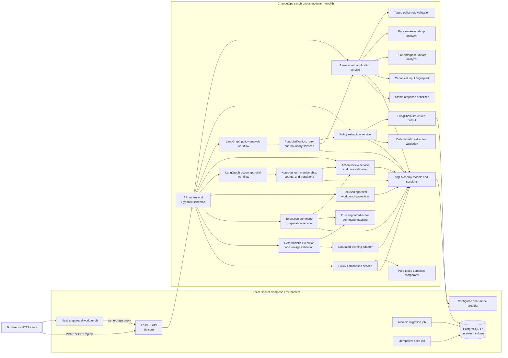
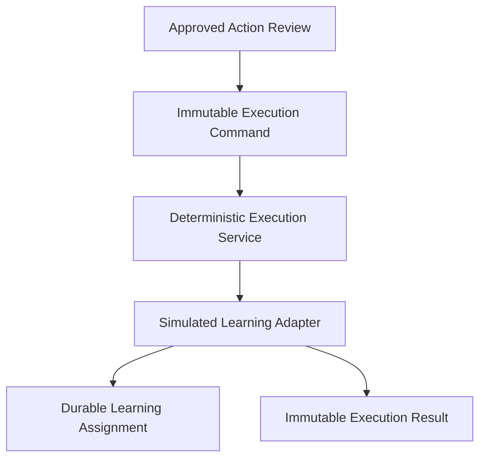
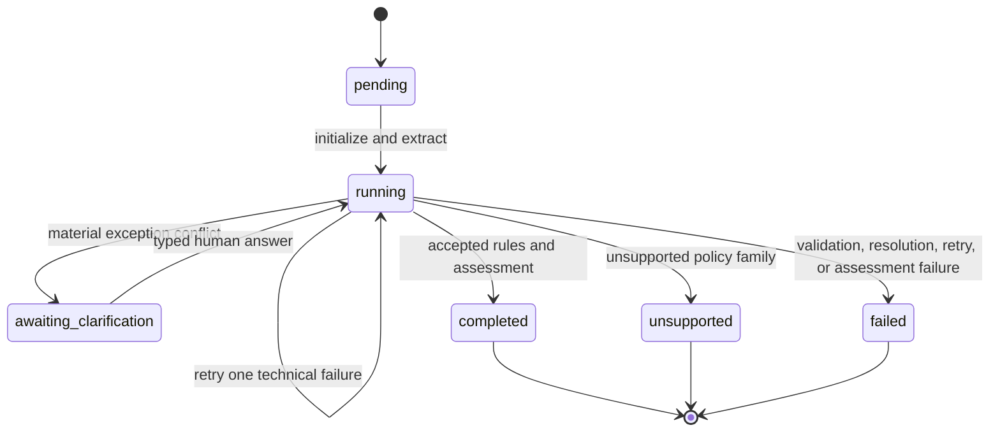
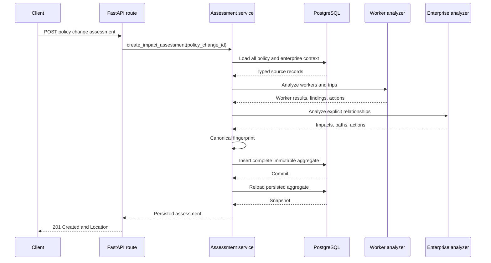
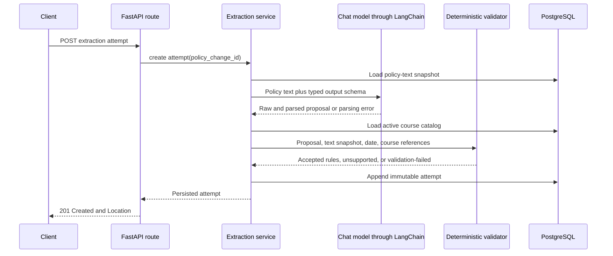

# ChangeOps Architecture

This document describes the current implementation through Milestone 5A: the completed
policy-analysis and approval lifecycles, the integrated Next.js journey and workbench,
deterministic preparation and explicit execution of one learning-assignment command, and immutable
deterministic comparison of two accepted international-travel policy rulesets.

## High-level architecture



ChangeOps remains a synchronous modular monolith. The HTTP, application, domain, serialization, and
persistence code run in one Python process. PostgreSQL stores source, extraction, workflow,
assessment, comparison, interpretation, review, approval-run, command, simulated
learning-assignment, and execution-result data. The Next.js runtime provides the local analysis,
comparison, and approval experiences. A configured
chat-model provider is the only external service used by extraction and interpretation; command
preparation and simulated execution have no external dependency.

## Major runtime components

### API

The FastAPI application exposes:

- `GET /healthz`
- `POST /api/v1/policy-changes/{policy_change_id}/impact-assessments`
- `GET /api/v1/impact-assessments/{assessment_id}`
- `POST /api/v1/policy-changes/{policy_change_id}/extraction-attempts`
- `GET /api/v1/policy-extraction-attempts/{attempt_id}`
- `POST /api/v1/policy-analysis-runs`
- `GET /api/v1/policy-analysis-runs/{run_id}`
- `GET /api/v1/policy-analysis-entry`
- `GET /api/v1/policy-analysis-runs/{run_id}/journey`
- `POST /api/v1/policy-comparisons`
- `GET /api/v1/policy-comparisons/{comparison_id}`
- `POST /api/v1/policy-analysis-runs/{run_id}/clarifications/{clarification_id}/answer`
- `POST /api/v1/impact-assessments/{assessment_id}/change-plans`
- `GET /api/v1/impact-assessments/{assessment_id}/change-plan`
- `GET /api/v1/change-plans/{change_plan_id}`
- `GET /api/v1/policy-interpretation-attempts/{attempt_id}`
- `POST /api/v1/proposed-actions/{proposed_action_id}/review`
- `GET /api/v1/proposed-actions/{proposed_action_id}/review`
- `GET /api/v1/action-reviews/{review_id}`
- `POST /api/v1/action-reviews/{review_id}/decisions`
- `POST /api/v1/impact-assessments/{assessment_id}/approval-run`
- `GET /api/v1/impact-assessments/{assessment_id}/approval-run`
- `GET /api/v1/action-approval-runs/{run_id}`
- `GET /api/v1/action-approval-runs/{run_id}/workbench`
- `POST /api/v1/action-approval-runs/{run_id}/resume`
- `POST /api/v1/action-approval-runs/{run_id}/execution-commands`
- `GET /api/v1/action-approval-runs/{run_id}/execution-commands`
- `GET /api/v1/execution-commands/{command_id}`
- `POST /api/v1/execution-commands/{command_id}/execute`

The create response adds an input fingerprint, enterprise-impact summary, and categorized
enterprise impacts. Existing worker results, findings, evidence, proposed actions, and unresolved
questions remain available.

Pydantic constrains impact domains, object types, classifications, and action types. It also
validates allowed domain-classification combinations.

### Deterministic policy comparison

Comparison is a synchronous application operation, not a workflow graph. The create service loads
two distinct `PolicyChange` records, requires common organization ownership, and resolves the most
recent completed `PolicyAnalysisRun` for each source. Each run must point to an accepted extraction
attempt that it and its policy own, have no pending clarification, retain the current source-text
snapshot and effective date, and expose complete validated policy-text or human provenance.

Compatibility checks inspect family and rule-schema values before reconstructing two immutable
`InternationalTravelPolicyRules` values. A pure domain comparator explicitly evaluates effective
date, worker location and types, trip origin and excluded destinations, booking exemption, and
training identifier. Collection membership produces stable `added` or `removed` differences;
scalar changes produce `modified`. Every supported change is operationally material under the
closed schema and owns a stable reason code. Identical typed semantics produce no difference even
when wording or source spans differ.

The service fingerprints the contract version, ordered baseline/proposed source identities,
accepted attempts, effective dates, rules, and semantic differences. It persists one
`PolicyComparison` plus ordered `PolicyComparisonDifference` children in one transaction. A
fingerprint uniqueness constraint makes repeated and concurrent equivalent creation idempotent.
PostgreSQL composite foreign keys bind organization/policy and attempt/policy ownership, checks
constrain classifications and side values, and triggers reject parent or child mutation.

The comparison UI is enabled only when both entry policies resolve as ready. It shows both sources,
accepted attempts, ordered values, provenance, materiality, and reason codes, while explicitly
stating that enterprise impact delta has not been calculated. AI can independently propose each
source extraction but is not invoked by comparison. LangGraph is likewise absent because the
operation has no pause, retry, or branching lifecycle.

### Action review and decision service

Review creation locks one immutable proposed action, verifies its completed assessment, and either
returns the existing review or snapshots the action plus its reason code and evidence keys. A
unique proposed-action constraint makes item-level creation idempotent under concurrent requests.

Decision submission accepts a trusted actor identity and role from `X-ChangeOps-Actor` and
`X-ChangeOps-Role`. Pure deterministic validation requires a pending review, authorized role,
nonempty rationale, supported decision, and—only for approval—actual changes limited to description
and due date. The body cannot assert reviewer identity.

The service locks the review, inserts one immutable decision event, and moves the review to the
matching terminal status in the same transaction. A second request receives a stable conflict.
Serialization returns original and context snapshots, decision history, the current decision, and
a derived effective approved action when applicable.

PostgreSQL composite foreign keys bind the review to the proposed action's assessment. Deferred
constraint triggers require pending reviews to have no decision and terminal reviews to have one
matching decision. Other triggers reject decision update/delete, snapshot or review-identity
changes, and all terminal review mutation. `proposed_actions` is never updated, and its database
constraint continues to require `execution_status = not_executed`.

### Durable action-approval workflow

Approval orchestration is separate from policy analysis. A completed `PolicyAnalysisRun` owns one
immutable completed `ImpactAssessment`; that assessment may own one `ActionApprovalRun`. Analysis
remains completed throughout review and approval.

Creation locks the assessment, validates its completed analysis lifecycle, and persists an
`initializing / create_reviews` run. The deterministic LangGraph then creates or reuses reviews
through the action-review service's transaction-owned helper and atomically stores ordered
`ActionApprovalRunItem` membership. Ordering uses worker, action type, target identifier, and action
ID, so the membership snapshot remains stable.

```text
START → load
  initializing/create_reviews → initialize_reviews → evaluate_reviews
  initializing/evaluate_reviews or awaiting_decisions → evaluate_reviews
  completed or failed → END

evaluate_reviews
  pending > 0 → persist awaiting_decisions/await_decisions → END
  pending = 0 → persist completed/finalize → END
```

PostgreSQL is authoritative durable state; graph state contains only identifiers, routing values,
and audit trigger context. Reaching `END` at the wait state returns control immediately. There is no
sleep, polling task, worker, scheduler, queue, or in-memory durable thread.

Decision submission commits the immutable human decision first. The API then resolves run
membership and synchronously invokes the graph. Evaluation locks the run row and derives counts
from every persisted review. Concurrent decisions can both commit, and serialized evaluations
reconcile both. Unexpected orchestration failure cannot roll back the decision; the authorized
explicit resume endpoint is the recovery path.

Run retrieval includes deterministic counts, stable item identifiers and links, sanitized failure
state, and append-only transitions. No-op waiting resumes and completed resumes do not mutate the
run. PostgreSQL constrains lifecycle ownership, one run per assessment, unique item sequence and
membership, count totals, terminal timestamps, immutable completed runs, and append-only
membership and transition records.

All four human decisions are terminal for this workflow. A mixed decision set completes once
pending reaches zero. Completion does not imply that rejected, deferred, or revision-requested
actions succeeded, and even approved actions remain `not_executed`.

### Execution command preparation

Preparation is a synchronous application service invoked only for a completed approval run. It
locks that run, loads immutable membership in sequence order, ignores every non-approved review,
and requires exactly one approval decision for each approved review. The service reuses the pure
effective-action overlay from action review, then calls a pure command mapper with no FastAPI,
SQLAlchemy, LangChain, LangGraph, or MCP dependency.

The current closed mapping supports only seeded worker training assignments:

```text
Completed Approval Run
  → approved ActionReview and approval decision
  → effective approved action
  → learning.assign_training command candidate
  → immutable ExecutionCommand(pending_execution)
```

All other golden-scenario action types, and invalid targets for the supported type, produce stable
unsupported projection items. Unsupported results are recalculated from immutable approval data;
there is no preparation-run aggregate or lifecycle.

`execution_commands` stores explicit `effective-approved-action-v1` and `execution-command-v1`
snapshots plus run, review, decision, proposed-action, and assessment references. The deterministic
idempotency key is SHA-256 over canonical JSON containing command schema, approval decision,
system, operation, target, and parameters. A run row lock serializes preparation; unique review and
fingerprint constraints provide final duplicate protection. Composite foreign keys bind each
command to the same run membership and review lifecycle.

Database triggers require a completed run and approved review decision, validate snapshot
identity, reject update and delete, and constrain status to `pending_execution`. Preparation never
changes `proposed_actions.execution_status`, calls an enterprise system, checks mutable enterprise
state, or creates an execution attempt.

### Simulated learning execution

The execution endpoint requires the same trusted local demonstration `admin` boundary used for
preparation. The service loads and row-locks the immutable command, then reconstructs authoritative
run membership, review, approval decision, effective approved action, deterministic mapping,
command snapshot, and idempotency key. A submitted command ID is therefore not sufficient by
itself. The persisted lineage must still prove a completed run and exact approval.

The command contract required no change. It already contains the worker and course identifiers,
operation and system, effective-action and parameter snapshots, idempotency identity, assessment,
proposed action, review, decision, run, preparer, and timestamp. The assessment reference also
allows an optional change plan to be resolved without making that later AI artifact authoritative
for deterministic actions.



`learning.assign_training` is the only dispatch path. The adapter validates a closed payload,
requires a real worker and active course, and performs no AI call. PostgreSQL commits the assignment
and successful result in one transaction. A row lock serializes requests for one command, while a
unique `source_execution_command_id` constraint is the durable backstop. The first attempt appends
`succeeded`; later attempts append `already_applied` results referencing the same assignment.
Unsupported and malformed adapter attempts have explicit immutable result statuses, although
normal preparation cannot create such commands because its mapping and database constraints are
closed.

Commands remain immutable and `pending_execution`; they represent authorization, not mutable
connector state. Simulated learning assignments represent enterprise state. Execution results
represent append-only attempt history. Proposed actions remain immutable `not_executed` assessment
artifacts, so execution never rewrites historical analysis or approval.

### Policy extraction service

The extraction endpoint loads only the policy text, effective date, and organization identifier
before invoking the model. LangChain binds a strict Pydantic output schema with
`with_structured_output(..., include_raw=True)`. The prompt contains policy text and the supported
schema boundary; it never contains workers, trips, completions, teams, dependencies, commitments,
existing impacts, or enterprise identifiers.

Model output is proposed data. A pure deterministic validator:

1. validates the structured schema and closed literals;
2. resolves each exact quoted passage to the nearest matching zero-based span in the stored policy
   snapshot, then rejects quotes that do not resolve;
3. checks supported family and version-1 business invariants;
4. verifies the extracted effective date against the policy record;
5. resolves the human-readable training-course name to exactly one active organization course;
6. constructs `InternationalTravelPolicyRules` only after every check passes.

The model never receives or proposes `training_courses.id`. Unsupported families and
unrepresentable constructs terminate with an explicit unsupported outcome. Parsing, grounding,
business-rule, and reference failures terminate with validation-failed. Neither outcome reaches the
assessment service.

### Assessment application service

The assessment service coordinates one synchronous transaction:

1. Load the policy and every organization record that can influence impact discovery.
2. Validate `policy_changes.structured_rules` as `InternationalTravelPolicyRules`.
3. Convert SQLAlchemy records to immutable domain input.
4. Run the existing pure worker-and-trip analyzer.
5. Run the pure enterprise-impact analyzer using the worker result and loaded context.
6. Calculate a SHA-256 fingerprint from canonicalized policy, source, dependency, and question
   input.
7. Persist the complete assessment aggregate.
8. Commit once, then reload the aggregate with explicit eager loading.

Any exception before commit rolls back the assessment, workers results, findings, evidence,
enterprise impacts, paths, actions, and copied questions.

The existing endpoint still validates `policy_changes.structured_rules`. A narrow second entry
point accepts an already validated `InternationalTravelPolicyRules` value from the workflow
boundary. It uses the same loaders, analyzers, fingerprinting, and persistence functions, so the
Milestone 1 engine is unchanged.

### Policy-analysis workflow

LangGraph coordinates explicit nodes; application and domain services make all decisions. Graph
state contains only the run, attempt, clarification, and assessment identifiers plus routing
fields. It does not contain policy text, raw model output, or enterprise records.



LangGraph owns declarative workflow topology, typed orchestration state, conditional routing, and
explicit node and transition boundaries. PostgreSQL owns authoritative durable state, workflow
lifecycle status, clarification state, persisted artifacts, auditability, and recovery across
processes and restarts.

Both graphs are compiled without a checkpointer. Policy analysis does not call LangGraph
`interrupt()` or resume a checkpoint thread. Starting or resuming creates a fresh graph invocation
whose route is derived from the run, latest attempt, and clarification rows. No in-memory workflow
object or opaque graph checkpoint is needed, and terminal runs do not execute again.

The deterministic materiality gate asks only
`booking_before_effective_date_exemption` in schema v1. Because the existing deterministic rule
model requires `booking_before_effective_date_is_exempt: Literal[True]`, this is explicitly a
`true` acknowledgement contract rather than an unrestricted boolean question. A `false` request
is rejected and leaves the clarification pending. The gate does not ask humans to repair malformed
output, identify unsupported policy families, or resolve arbitrary free-form questions.
`non_material_ambiguity` findings do not pause when all required fields validate. Course-name
resolution failures terminate with `enterprise_reference_unresolved`.

Malformed output and provider invocation failures receive at most one new extraction attempt.
Unsupported output, deterministic invariant failures, and enterprise-reference failures are not
blindly retried. Exhaustion terminates with `retry_limit_exhausted`.

Before provider invocation, the durable run moves to `running / extract`; it therefore remains
observable while the synchronous HTTP request is open. Provider construction applies explicit
timeouts and disables provider-library retries so the workflow remains the single owner of its
bounded retry policy. Start/completion logs include provider/model identifiers, elapsed time, parse
success, and a sanitized error category without policy text or raw provider output.

The assessment adapter reloads the persisted attempt, requires `accepted`, validates its typed
rules again, rejects pending clarification, and then calls the deterministic assessment service.
A unique nullable `impact_assessments.policy_analysis_run_id` prevents duplicate assessments.

### Coverage-gap interpretation

Interpretation is an explicit synchronous operation after a policy-analysis run has completed and
its immutable assessment exists. Deterministic application code eagerly loads that assessment
aggregate, the accepted extraction attempt, stored policy-text snapshot, accepted provenance,
answered clarifications, actions, and unresolved questions. It builds a stable, bounded DTO before
calling LangChain structured output. The interpreter receives no SQLAlchemy session, repository,
tools, ORM records, or raw enterprise source tables.

The interpretation DTO exposes the validated policy effective date separately from
`accepted_rules`, matching the deterministic `PolicyInput` boundary. The prompt defines those
fields together as the complete accepted policy representation so normalized storage does not
appear to be a coverage gap.

The interpreter uses LangChain's `function_calling` structured-output method over OpenAI's
Responses API because its nested Pydantic schema is outside OpenAI's stricter native JSON-schema
subset and reasoning-enabled function tools are unsupported by the Chat Completions API.
Start/completion logs record the run, assessment, provider/model identifiers, elapsed time, parse
success, and a sanitized error category without persisted input or raw provider output.

The model-facing proposal schema permits only review concerns grounded by exact policy quotes,
existing impact IDs, and existing evidence keys. It does not ask the model to calculate offsets or
repeat policy IDs, assessment IDs, evidence-owner IDs, or relationship-path positions. It
structurally forbids impact mutations and asserted enterprise facts.

Deterministic application code converts each proposal into the stricter candidate schema: exact
quotes become zero-based policy spans, lifecycle IDs come from the input, and evidence owners are
derived from persisted findings and impacts. A pure validator then resolves every typed reference
against the input; absent quotes and invented impact or evidence identifiers remain invalid. The
validator also accepts an empty gap list. Accepted output is stored as a separate immutable JSON
aggregate; it does not own or duplicate impacts.

Every invocation produces an append-only `policy_interpretation_attempts` row containing provider,
model, prompt/schema versions, raw and candidate output, validation errors, and a stable failure
code. `change_plans` has a unique assessment foreign key, enforcing one accepted plan per
assessment. Repeated creation returns that plan. Invalid/provider-failed attempts do not block a
later retry. Provider construction is lazy, so returning an existing plan does not require provider
configuration. Composite foreign keys require every plan's run, assessment, and accepted attempt
to belong to the same lifecycle. PostgreSQL triggers reject attempt and plan updates or deletes.

Interpretation errors are isolated after assessment completion. They never change the
policy-analysis run from `completed`, roll back the assessment, or affect assessment retrieval.
Product UI, approval, prioritization, action sequencing/execution, RAG, tools, and additional policy
families remain deferred.

### Deterministic analyzers

Both analyzers are pure Python. They do not import FastAPI or SQLAlchemy, perform database or
network I/O, or mutate input.

The Milestone 0 analyzer continues to evaluate:

- worker and trip scope;
- policy effective date;
- booking-date approval exception;
- security-training completion.

The Milestone 1 analyzer deterministically derives:

- directly affected workers;
- operationally affected managers and teams;
- systems connected to changed approval or training rules;
- documents connected through explicit policy dependencies;
- the policy-required course and worker-specific incomplete-training impacts;
- customer commitments with a required assigned worker and inclusive trip-date overlap.

It returns immutable impacts, stable reason codes, evidence keys, ordered path elements, and
unexecuted action proposals. Domain ordering is fixed as people, teams, systems, documents,
training, and customer commitments.

### Input fingerprint

The canonical fingerprint includes:

- analyzer version and complete typed policy input;
- workers and managers;
- worker-team memberships and teams;
- trips;
- courses and completion records;
- systems, documents, and all typed policy dependencies;
- customer commitments and assignments;
- unresolved questions.

Every source collection is sorted by stable semantic identifier before canonical JSON encoding.
Database row order does not affect the fingerprint; a relevant field change does.

### Response serializer

The serializer reads only the persisted assessment snapshot. It:

- sorts worker results, findings, evidence, impacts, actions, and questions by semantic keys;
- preserves persisted path sequence;
- groups impacts into six explicit domain collections;
- calculates summary counts from the returned persisted records;
- links action identifiers to their enterprise impacts;
- always serializes action execution as `not_executed`.

It does not query mutable source tables.

## Request and persistence flow



Retrieval loads the aggregate with `selectinload` and serializes it with the same stable ordering.
There are no assessment update or delete endpoints.

Policy extraction is a separate synchronous flow:



## Persistence model

### Source data

Milestone 0 source tables remain:

- `organizations`
- `workers`
- `trips`
- `training_records`
- `policy_changes`
- `policy_change_questions`

Milestone 1 adds:

- `teams`
- `worker_team_memberships`
- `enterprise_systems`
- `enterprise_documents`
- `training_courses`
- `customer_commitments`
- `commitment_assignments`
- `policy_system_dependencies`
- `policy_document_dependencies`
- `policy_training_dependencies`

Managers use stable worker records referenced by `workers.manager_worker_id`. A narrow membership
table gives each demonstration worker one current team. Separate dependency tables preserve real
foreign keys to systems, documents, and courses; there is no polymorphic graph target.

`training_records.course_identifier` now references `training_courses.id`.

### Append-only extraction attempts

`policy_extraction_attempts` stores the policy-text snapshot, raw and parsed model output, candidate
and accepted rules, provenance, findings, validation errors, and provider/model/prompt/schema
versions. Every POST inserts a new UUID row. A PostgreSQL trigger rejects updates and deletes so
failed and superseded attempts remain inspectable. Workflow attempts additionally reference their
run and record a retry or human-clarification derivation reason.

### Immutable policy comparisons

`policy_comparisons` owns the baseline/proposed relationship, organization, two authoritative
accepted attempts, compact policy display snapshots, comparison contract, SHA-256 fingerprint,
creator, and creation time.
`policy_comparison_differences` stores stable sequence and rule identity, field path,
classification, baseline/proposed semantic values, deterministic materiality and reason code, and
validated side-specific provenance snapshots. This is a bounded aggregate for
`international_travel / schema_version 1`; it is not policy version management, a generic schema
registry, event sourcing, or a generic JSON diff.

### Durable workflow records

`policy_analysis_runs` stores the immutable policy snapshot, closed status and step, latest
attempt, assessment, retry count, stable failure information, versions, accepted-rule provenance,
and timestamps. `policy_analysis_clarifications` stores an immutable question/code/answer contract,
affected fields, status, typed answer, responder, explicit human provenance, and timestamps.
Question-defining columns are protected from update by a PostgreSQL trigger.

Clarification answers are written once under row locks. Duplicate or concurrent answers conflict.
The original question is never replaced, and human facts never receive fabricated policy-text
spans.

This synchronous slice assumes one active workflow executor per run. Row locks serialize
clarification answers and run-state attachment, and the unique assessment association makes
assessment recovery idempotent, but extraction invocation is not protected by a lease held across
the provider call. Concurrent executors could therefore create multiple append-only attempts and
race to set the latest attempt. A future asynchronous-worker slice should add a guarded execution
token or compare-and-set transition before supporting multiple executors; this PR intentionally
does not introduce distributed locks or a queue.

### Immutable assessment aggregate

The Milestone 0 snapshot tables remain:

- `impact_assessments`
- `assessment_worker_results`
- `findings`
- `evidence`
- `finding_evidence`
- `proposed_actions`
- `assessment_unresolved_questions`

Milestone 1 adds:

- `assessment_enterprise_impacts`
- `assessment_impact_evidence`
- `assessment_impact_path_elements`

Enterprise impacts store domain, object type, stable source key, display name, classification,
explanation, reason code, and sort key in relational columns. Evidence remains a narrowly scoped
JSONB source snapshot linked through join tables. Relationship paths are ordered rows containing
object type, stable key, display label, and relationship to the next element.

`proposed_actions` may reference a finding, an enterprise impact, or both. A database check requires
at least one parent, and the existing `execution_status = 'not_executed'` constraint remains.

Assessment immutability is an application invariant:

- each analysis creates a new aggregate;
- source changes never update prior snapshots;
- the API exposes no assessment mutation;
- all aggregate rows commit atomically.

### Uncertainty records and product-facing projection

ChangeOps currently has two uncertainty representations with different lineage:

- extraction-attempt findings record model-proposed ambiguity and validation observations;
- `policy_analysis_clarifications` records the bounded human-resolution workflow and is
  authoritative for whether a policy-analysis run pauses, what was answered, by whom, and when;
- `policy_change_questions` contains eight seeded Milestone 0 scenario questions, which the
  assessment service copies verbatim into `assessment_unresolved_questions`.

The copied assessment questions are immutable historical fixture data. They do not drive
extraction validation, clarification routing, impact analysis, approval, command preparation, or
execution. They do participate in the assessment input fingerprint and are exposed by the
assessment API and interpretation input. Because the current response calls them
`unresolved_questions` without their seed provenance, a client can incorrectly infer that they
were detected by the model that produced a policy-analysis assessment.

The authoritative current uncertainty workflow is the extraction finding followed, when the
deterministic materiality gate requires it, by the persisted clarification record. The
policy-analysis journey projection exposes that history directly and marks the legacy assessment
questions as omitted schema-v1 fixtures. Existing immutable assessments and the schema-v1
assessment response remain unchanged.

The same journey projection derives evaluated-object coverage without adding persistence. Active
systems, non-archived documents, teams, and active customer commitments in the analysis
organization are considered; persisted impact source keys classify affected objects, and the
remaining evaluated objects are projected as cleared. Impact records and coverage therefore stay
distinct: affected objects own immutable impact records, while cleared objects exist only in this
read model.

### Immutable execution commands

`execution_commands` is the audit boundary between human approval and future tool invocation.
Approval proves what a person decided; a command proves what deterministic mapping code prepared.
Command snapshots remain meaningful even if a later mapping version changes. Unsupported
eligibility is derived rather than persisted because all inputs are immutable and no preparation
workflow state is required.

### Simulated learning state and execution history

`simulated_learning_assignments` stores the one enterprise side effect supported by this slice:
worker, course, assignment status and time, source command, and source approved action. One command
can own at most one assignment. Insert validation checks that assignment values exactly match the
command; mutation is rejected for the current narrow assignment lifecycle.

`execution_results` is append-only and stores the command, optional assignment, outcome, stable
code and explanation, command idempotency key, execution actor, role, and timestamp. PostgreSQL
checks outcome/assignment consistency and rejects update or delete. Replays add history without
duplicating simulated enterprise state.

## Seeded demonstration catalog and reset

The idempotent seed contains:

- one baseline international-travel source and one proposed revision source;
- six travelers and six manager worker records;
- four teams and six memberships;
- three systems, one unaffected;
- four documents, one unaffected;
- one explicit International Travel Security course;
- six completion records;
- typed policy dependencies for two systems, three documents, and the course;
- two customer commitments and assignments, one affected by date overlap.

The completed golden assessment returns:

- three affected and three unaffected traveler results;
- six Milestone 0 findings;
- 18 enterprise impacts across all six domains;
- 13 proposed actions, all unexecuted;
- eight copied unresolved questions.

The proposed source naturally changes the accepted effective date, worker-type coverage, and
destination exclusions. The normal Compose seed persists no accepted attempt, completed analysis,
or completed comparison for either source. The historical
provider-free assessment seed remains available to focused integration tests, but it is not loaded
into the reviewer application because a pre-completed run obscures the start of the golden path.

`make demo-reset` applies migrations, runs the idempotent catalog seed, then truncates the explicit
set of comparison- and workflow-owned tables in one transaction. It preserves both policy sources
and other catalog tables and requires an exact
confirmation value, recognized local PostgreSQL host and database name, and the seeded organization
marker. No database or volume is dropped.

## Policy-analysis journey read model

The journey projection resolves immutable change-plan impact and evidence references against the
same persisted assessment. It adds display names, domains, classifications, reason codes, evidence
labels and source identifiers while retaining original UUIDs and evidence keys. Policy quotes are
rechecked against the run's persisted policy snapshot. Missing, cross-assessment, or wrongly owned
references raise a stable integrity error rather than disappearing from the response.

The same read model summarizes approval and execution independently. Approval status comes from the
approval run; execution eligibility, prepared-command count, executed-command count, result count,
and replay count come from persisted commands and results. These values are derived for display and
are never written back to the plan, assessment, or workflow.

## Approval workbench read boundary

The Next.js App Router application lives under `web/`. Initial workbench loading is server
rendered. Client state owns only reviewer identity and pending form values; native fetch submits to
a same-origin proxy configured by `CHANGEOPS_API_BASE_URL`, and route refresh reloads
PostgreSQL-backed state after every write.

The API projection service loads one approval run, its immutable membership, review snapshots, the
completed assessment, findings, enterprise impacts, evidence records, and relationship-path rows.
It preserves membership sequence and validates every reference before serialization. It neither
mutates domain records nor persists a screen snapshot.

After completion, the page separately loads the focused execution-command projection. The panel
shows approved, eligible, unsupported, and prepared counts; prepared command target and operation;
effective approved values; approval lineage; execution state and results; and a shortened
idempotency key. POST preparation and explicit supported-command execution use the same local actor
field with the `admin` demonstration role, then refresh authoritative server state. There is no
automatic, retry-orchestrated, or bulk execution.

## External dependencies and boundaries

The assessment endpoints communicate only with PostgreSQL. Extraction and policy-analysis create
or retry operations additionally use LangChain Core and the configured `langchain-openai` chat
model integration. LangGraph 1.0.8 provides the narrow orchestration runtime.

There are no:

- agents, tool-calling loops, embeddings, RAG, or vector-search components;
- MCP or live enterprise integrations;
- graph databases;
- background workers or message queues;
- execution beyond the single simulated learning assignment;
- production authentication or user-administration components.

## Quality and provider verification boundaries

GitHub Actions runs two read-only merge checks on pull requests and pushes to `main`. The `quality`
job builds and executes the development Compose services for Ruff, the complete pytest suite, and
all four versioned offline evaluations. `OPENAI_API_KEY` is explicitly empty in this workflow, so
fixture-backed tests cannot inherit a live provider secret. The `migration` job uses an empty
PostgreSQL database and verifies the current Alembic head can upgrade, downgrade one revision, and
upgrade again.

The four required evaluations are deterministic contract evaluations over fixed fixtures. They
protect structured-output handling, validation, routing, lifecycle calculations, grounding,
provenance, and fail-closed behavior. They do not invoke a provider and do not measure live model
accuracy.

A separate dispatch-only workflow starts an isolated Compose stack with a repository provider
secret and runs the canonical extraction, workflow, assessment, and interpretation path. Its
Python runner asserts typed acceptance, deterministic assessment counts, grounded plan
acceptance, retrieval, idempotency, and assessment immutability. It emits only configuration
names, elapsed time, lifecycle identifiers, terminal outcome, and a stable failure code. This
manual smoke checks provider compatibility and one live end-to-end path. It is non-gating and is
not a comprehensive model-quality benchmark.

## Technology stack

### Runtime

- Python 3.12
- FastAPI 0.141.1
- Uvicorn 0.52.0
- Pydantic Settings 2.14.2
- LangChain Core 1.5.3
- LangChain OpenAI 1.4.1
- LangGraph 1.0.8
- SQLAlchemy 2.0.51
- Psycopg 3.3.4
- Alembic 1.18.5
- PostgreSQL 17
- Docker Compose
- Next.js 16.2.12 and React 19.2
- TypeScript 5.9

### Development and testing

- pytest 9.1.1
- httpx2 2.9.1 through FastAPI `TestClient`
- Ruff 0.16.1
- Vitest and Testing Library for focused frontend behavior tests
- a dedicated PostgreSQL `changeops_test` database created and removed by the integration fixture
