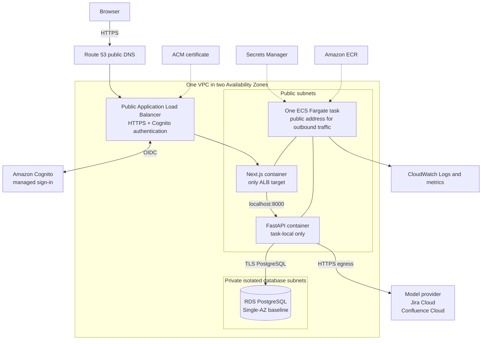

Architectural Decisions
* Modular monolith, not microservices.
* FastAPI backend.
* PostgreSQL persistence.
* Deterministic impact matching first.
* LLM extraction comes after the expected policy structure works.
* LangGraph is introduced only when the workflow has multiple meaningful states.
* No frontend in Milestone 0.
* No MCP or simulated enterprise APIs yet.
* No approval execution yet.

# ADR-0007 — Delay AI Until Enterprise Context Exists

## Status

Accepted

## Context

ChangeOps is intended to demonstrate both enterprise software architecture and practical AI engineering.

Earlier project planning introduced LLM-based policy extraction immediately after the deterministic impact assessment.

As the product matured, the project evolved from demonstrating AI technologies to demonstrating an enterprise change-management platform that uses AI where appropriate.

This raised an architectural question:

Should AI be introduced immediately after the deterministic policy assessment, or should deterministic enterprise context be established first?

## Decision

ChangeOps will establish deterministic enterprise impact discovery before introducing AI workflows.

Milestone 1 expands deterministic analysis across multiple enterprise domains, including:

- people
- teams
- systems
- documentation
- training
- customer commitments

These relationships are represented explicitly using normalized enterprise data and deterministic business rules.

Milestone 2 introduces AI to perform tasks that require interpretation rather than deterministic evaluation, including:

- extracting structured policy changes from natural language
- identifying ambiguity
- synthesizing evidence across domains
- generating recommendations
- coordinating multi-step workflows

AI is intentionally not responsible for determining known enterprise relationships or applying deterministic business rules.

## Consequences


### Positive

- Clear separation between deterministic and probabilistic reasoning.
- Easier testing and regression verification.
- Explainable enterprise impact analysis.
- Stronger architectural justification for LangGraph.
- AI operates on trusted enterprise context rather than raw operational data.
- Better demonstration of enterprise software design.

### Negative

- AI capabilities appear one milestone later.
- Milestone 1 requires additional enterprise modeling before LLM features become visible.

## Alternatives Considered

### Introduce AI immediately after Milestone 0

Pros

- Earlier demonstration of LangChain and LangGraph.
- Faster visible AI functionality.

Cons

- AI introduced before a clear architectural need.
- Deterministic engine becomes little more than preprocessing.
- Weaker explanation of why workflow orchestration is required.

## Rationale

ChangeOps is intended to demonstrate thoughtful engineering decisions rather than maximum technology usage.

Technologies should enter the architecture only when they solve a demonstrated product problem.

Establishing deterministic enterprise context first produces a stronger foundation for later AI planning, approval workflows, execution, and auditing.

# ADR-0008 — Use Typed Relational Dependencies and Immutable Impact Paths

## Status

Accepted

## Context

Milestone 1 must explain impacts across several enterprise domains without introducing a graph
database or an opaque assessment payload.

## Decision

ChangeOps uses ordinary PostgreSQL relationships for the scoped enterprise context:

- workers reference manager workers;
- worker-team memberships connect workers and teams;
- customer assignments connect workers and commitments;
- separate policy-system, policy-document, and policy-training tables preserve target foreign keys.

Completed assessments store enterprise impacts as relational rows. Evidence uses a join table, and
each relationship path is stored as ordered path-element rows. Cross-domain proposed actions link
to their impact and retain `execution_status = not_executed`.

The existing pure worker analyzer remains intact. A second pure enterprise-impact analyzer consumes
immutable typed input, and the application service coordinates both after loading all source data.

## Consequences

- Target integrity remains enforceable with foreign keys.
- Impact records, evidence, paths, and actions remain directly queryable.
- Historical paths do not change when source relationships later change.
- Adding a new dependency target requires an explicit table and analyzer rule.
- The design intentionally does not provide a generalized enterprise graph or rules engine.

## ADR-0009: Separate AI Language Understanding and Interpretation from Deterministic Impact Analysis

**Status:** Accepted  
**Date:** 2026-08-01

### Context

ChangeOps must analyze policy and operational changes while preserving explainability, reproducibility, auditability, and human control.

Milestone 1 established a deterministic enterprise impact-analysis engine. Given validated policy rules and the same enterprise data, it produces the same immutable assessment, including impacts, evidence, reason codes, relationship paths, and proposed actions.

Milestone 2 introduces AI for work that deterministic software cannot perform reliably from unstructured language alone. The architecture must demonstrate structured extraction, ambiguity handling, evidence-grounded interpretation, durable workflows, and human clarification without allowing an LLM to become the authoritative source for enterprise facts, relationships, or impact conclusions.

The workflow must also support a policy analysis run that pauses for human clarification and resumes later, potentially in a different process. A workflow run can therefore exist without an impact assessment and may terminate without producing one.

### Decision

ChangeOps will use a policy-analysis pipeline in which AI owns **language in** and **interpretation out**, and owns nothing in between.

```text
policy text
    ↓
AI policy understanding
    ↓
candidate typed rules, source provenance, and open questions
    ↓
deterministic validation and clarification gate
    ↓
validated policy rules
    ↓
deterministic enterprise impact analysis
    ↓
immutable impact assessment
    ↓
AI interpretation of the persisted assessment
    ↓
separate change-plan artifact
    ↓
human review
```

Four principles govern every AI step:

1. **AI assists; deterministic code decides.**
2. **AI output remains proposed until validated.**
3. **Every AI claim must reference existing source text, evidence, or assessment records.**
4. **Every AI step must have a test or evaluation that can fail.**

### AI responsibilities

The policy-understanding step may:

- extract candidate typed policy rules from policy text;
- identify ambiguity, missing information, and unsupported policy constructs;
- attach source-text provenance to extracted fields and open questions.

The interpretation step may:

- identify coverage gaps in the deterministic assessment;
- identify residual risks or conflicts grounded in the policy and assessment;
- synthesize related findings across impact domains;
- explain findings in human-readable form.

The extraction and interpretation roles must remain separate.

The extractor receives policy text but not workers, trips, training records, enterprise relationships, or other source-table context.

The interpreter receives the policy text and completed immutable assessment but does not query enterprise source tables directly.

### Responsibilities retained by deterministic code

AI must not:

- decide whether an enterprise object is affected;
- add, remove, or reclassify impacts;
- create impact domains, classifications, reason codes, action types, or evidence keys;
- create or alter enterprise facts or relationships;
- perform authoritative date arithmetic, filtering, overlap calculations, counting, or ordering;
- generate identifiers, fingerprints, or stable sort keys;
- perform schema, enum, referential, or business-rule validation;
- control workflow transitions, retries, completion, or clarification bypass;
- approve recommendations or execute actions against enterprise systems.

The deterministic impact engine remains authoritative and unchanged below the validated-rules boundary.

### Validation and grounding

AI-generated policy rules are candidate data until they pass:

- structured-output validation;
- closed-enum validation;
- business-rule validation;
- referential resolution;
- supported-policy validation.

An unsupported or unrepresentable policy must fail closed rather than be coerced into the current schema.

AI interpretation is stored separately from the immutable impact assessment. The model cites exact
policy quotes and existing impact IDs or evidence keys; deterministic code constructs span offsets,
lifecycle IDs, and evidence ownership. Every resulting reference must resolve against the persisted
assessment before the interpretation artifact is accepted.

The model may reference existing evidence but may not create authoritative evidence.

### Human clarification

AI may identify that clarification is needed, but deterministic code decides whether the workflow pauses.

Human clarification is treated as an explicit workflow input, not as an informal conversation. It must be persisted with provenance and used when validating the resulting policy rules.

Because clarification can change the validated rules and therefore the resulting assessment, material clarification must be included in the traceability and fingerprinting model defined by Milestone 2.

### Workflow orchestration

LangGraph is used for declarative workflow topology, typed orchestration state, conditional
routing, and explicit node and transition boundaries. It is not an autonomous agent framework or
the durable system of record.

PostgreSQL persists policy-analysis lifecycle state, extraction attempts, clarification records,
artifacts, and audit data. Both graphs are compiled without a LangGraph checkpointer. A resumed
analysis is a fresh graph invocation whose initial route is derived deterministically from those
records; it does not resume an opaque checkpoint thread.

Workflow routing is implemented in code. Model output may be an input to a routing decision, but
the model is never the router.

The current workflow could be expressed as sequential Python over the same persisted state.
LangGraph is retained because its explicit topology and transition model improve explainability,
separation of orchestration from business rules, inspection, and maintainable extension. This is a
tradeoff, not a claim that cross-process durability requires LangGraph.

A workflow run and an impact assessment have separate lifecycles. A run may be paused, unsupported, failed, abandoned, or completed without an assessment. A completed run may reference the assessment it produced.

### Evaluation

Evaluation responsibilities are separated by architectural layer:

- **Grounding and referential integrity** are deterministic assertions and must fail tests when references do not resolve.
- **Required CI contract evaluations** replay fixed model outputs and deterministic cases to protect
  structured-output, routing, lifecycle, provenance, grounding, and fail-closed behavior. They do
  not measure live provider accuracy.
- **Live provider verification** is a manually dispatched, non-gating smoke of the canonical
  extraction and interpretation path. It checks provider compatibility and end-to-end invariants,
  not comprehensive model quality.

No conclusion may be jointly owned by the deterministic engine and an AI step.

### Consequences

#### Positive

- The deterministic impact engine remains reproducible, explainable, and diffable.
- AI is used only where language understanding or interpretation provides real value.
- Invented impacts cannot enter the authoritative assessment through the AI layer.
- Extraction and interpretation can be evaluated independently.
- Human clarification is traceable and resumable.
- The architecture provides a defensible reason for using LangGraph.
- Immutable assessments remain unchanged by later AI interpretation.
- AI outputs can be rerun against a fixed assessment without recomputing deterministic impacts.

#### Negative

- The system requires separate persistence models for workflow runs, AI extraction results, human clarifications, and interpretation artifacts.
- The deterministic guarantee becomes: the same validated rules and enterprise data produce the same assessment. It does not extend to raw policy text producing identical extracted rules across model or prompt versions.
- Extraction runs must record model, prompt, and schema versions.
- The supported policy schema remains intentionally narrow, and unsupported policies must terminate without an assessment.
- The workflow is more complex than a synchronous request/response operation.

### Alternatives considered

#### AI extraction only

Rejected because structured extraction alone leaves reviewers with an impact list but no grounded explanation of coverage gaps, residual uncertainty, or cross-domain concerns.

#### Full AI orchestrator

Rejected because allowing an LLM to own extraction, impact reasoning, workflow control, and recommendations would undermine the deterministic engine and make authoritative conclusions non-reproducible.

#### Single AI agent with database tools

Rejected because it would allow policy extraction to become influenced by enterprise outcomes and would allow interpretation to bypass the immutable assessment aggregate.

#### Sequential Python workflow without LangGraph

Viable: PostgreSQL already provides the required persistence and cross-process recovery. Retaining
LangGraph adds an explicit, inspectable topology and conditional transition model at the cost of
another framework. Reconsider this choice if the graph stops improving explainability or
maintainability relative to straightforward sequential orchestration.

### Follow-up decisions

`docs/milestone-2.md` will define:

- the supported `international_travel` extraction scope;
- extraction-result and workflow-run schemas;
- clarification-gate rules;
- human-input provenance and fingerprinting;
- LangGraph state and node boundaries;
- retry and failure behavior;
- interpretation scope for Milestone 2;
- LangChain usage;
- prompt and model versioning;
- evaluation datasets, rubrics, and thresholds.

# ADR-0010 — Separate Immutable Action Review from Proposed Actions

## Status

Accepted

## Context

Milestone 3 must record consequential human decisions without rewriting the immutable assessment
that explains what the system originally proposed. Approval fields on `proposed_actions` would
combine historical analysis with a later human workflow and would lose the distinction between
original and edited values.

## Decision

ChangeOps uses a separate item-level action-review aggregate:

- one review per proposed action;
- a versioned immutable original-action snapshot;
- a small evidence-context snapshot;
- zero or one append-only decision event in the first slice;
- a persisted review status that must match its decision;
- optional typed description and due-date edits only for approval;
- a derived effective approved action rather than an executable record.

PostgreSQL composite foreign keys, uniqueness constraints, row locks, mutation triggers, and
deferred lifecycle constraint triggers enforce the aggregate. Reviewer identity is copied from a
narrow request-header authorization context. The proposed action is never updated.

## Consequences

- Original recommendations and reviewer edits remain independently auditable.
- Concurrent decisions have exactly one database winner.
- Later execution can consume an effective approved snapshot without treating the assessment as
  mutable.
- The first slice deliberately permits only one terminal decision and has no reopening or
  supersession semantics.
- Request headers demonstrate an authorization boundary but must be replaced by production
  authentication before external deployment.

# ADR-0011 — Separate Durable Approval Run from Completed Policy Analysis

## Status

Accepted

## Context

Policy analysis completes when it persists one immutable deterministic assessment. Human review can
begin much later, pause repeatedly, and fail independently. Reopening the completed analysis run or
inferring approval membership forever from all reviews would combine two business lifecycles and
make historical workflow scope unstable.

## Decision

ChangeOps uses one approval-specific aggregate per completed policy-analysis assessment:

- `ActionApprovalRun` stores lifecycle state, current step, deterministic counts, failure state, and
  timestamps;
- `ActionApprovalRunItem` snapshots ordered proposed-action and action-review membership;
- `ActionApprovalRunTransition` stores append-only transition visibility;
- a narrow deterministic LangGraph initializes membership, evaluates persisted reviews, ends at
  each human wait state, and completes when no item is pending;
- PostgreSQL remains authoritative, and each invocation starts from the persisted run ID;
- a committed review decision triggers synchronous post-commit resume, while an authorized
  idempotent endpoint provides explicit reconciliation.

The existing item-level review owns decisions and action snapshots. The approval run duplicates
neither. The completed policy-analysis run and impact assessment are never changed.

## Consequences

- Approval waiting and progress survive API restart without a worker, queue, scheduler, polling
  loop, or open HTTP request.
- Stable membership and transition records make the assessment-level process auditable.
- Row locking plus deterministic recalculation reconciles concurrent decisions safely.
- Automatic-resume failure cannot erase a valid human decision.
- All terminal decision types complete workflow items, but only approval may become a candidate for
  future execution.
- This slice adds approval-specific orchestration rather than a generic workflow platform.
- No action executes, and demonstration authorization headers still require replacement before
  public deployment.

# ADR-0012 — Add a Read-Only Approval Workbench Projection

## Status

Accepted

## Context

The reviewer screen needs approval lifecycle data, full item snapshots, deterministic finding or
enterprise-impact context, resolved evidence, and ordered relationship paths. Making the browser
assemble these resources would duplicate reference validation and workflow ordering outside the
backend ownership boundary.

## Decision

The frontend consumes one screen-oriented deterministic projection:
`GET /api/v1/action-approval-runs/{run_id}/workbench`.

- The projection reuses persisted domain records and existing run/review serializers.
- Immutable approval membership determines item order.
- Every evidence and context reference must resolve or the endpoint returns a stable inconsistency
  error.
- Domain write APIs for run creation, decisions, and manual resume remain unchanged.
- No durable workbench aggregate or snapshot is created.
- This is a focused application projection, not a generic backend-for-frontend framework.

## Consequences

- Initial server rendering can load one coherent reviewer representation.
- The backend remains authoritative for validation, ordering, progress, provenance, and effective
  approved-action derivation.
- Read retrieval performs no database mutation.
- The frontend can refresh after writes without reproducing approval transition logic.
- A future screen with materially different needs may require its own explicit projection rather
  than expanding this endpoint into generic query infrastructure.

# ADR-0013 — Materialize Immutable Execution Commands Before Tool Invocation

## Status

Accepted

## Context

An approved review currently proves what a person decided, but deriving connector input only at
execution time would make historical authorization depend on later application mapping code.
Allowing an MCP tool or adapter to derive action semantics would also couple integrations to review
serialization, assessment-era schemas, and approval workflow internals.

## Decision

ChangeOps materializes a separate immutable execution command before any tool invocation:

- command construction is pure and deterministic;
- the command snapshots exact effective approved values;
- a separate versioned snapshot stores connector-neutral parameters;
- relational provenance links the command to run, review, approval decision, proposed action, and
  assessment;
- canonical semantic JSON plus the approval decision produces a SHA-256 idempotency key;
- one command may exist per approved review;
- unsupported approved actions are explicit projection results;
- command rows are immutable and remain `pending_execution`;
- preparation runs synchronously in the modular monolith and changes no enterprise state.

The first mapping supports only seeded learning assignments. MCP and simulated adapters will
consume the stable command contract in later slices. This decision introduces neither a queue nor
a generic command bus, adapter registry, or preparation workflow.

## Consequences

- Approval and deterministic execution authorization are independently auditable.
- Future mapping-code changes cannot rewrite already prepared commands.
- Repeated and concurrent preparation reuses the same semantic command.
- Connectors can focus on current-state validation and invocation rather than deciding approval
  semantics.
- The system gains a table, migration, API projection, and lifecycle boundary before execution.
- Unsupported recommendations stay visible instead of being silently skipped or falsely treated
  as executable.
- No MCP tool, simulated system, or external service is called in this slice.

# ADR-0014 — Validate the Command Boundary with One In-Process Learning Adapter

## Status

Accepted

## Context

The immutable execution-command boundary must be proven by a real consumer before ChangeOps adds
MCP or generalized connector infrastructure. The seeded training command already contains an
approved worker, fixed course identifier, closed operation and system, canonical idempotency key,
and complete assessment and approval lineage. Execution additionally needs durable side-effect
state and immutable attempt metadata, but those are not command concerns.

## Decision

ChangeOps executes only `learning.assign_training` through one explicit synchronous
`SimulatedLearningAdapter` inside the modular monolith.

- Execution requires an explicit authorized `admin` request.
- The application service row-locks the command and revalidates persisted approval lineage and
  exact command semantics.
- The adapter validates a closed payload and verifies the worker and active course.
- One `SimulatedLearningAssignment` records durable simulated enterprise state.
- Every adapter attempt records a separate immutable `ExecutionResult`.
- Assignment and success result commit in one PostgreSQL transaction.
- One assignment per source command is enforced by a database uniqueness constraint.
- Repeated requests append `already_applied` results referencing the original assignment.
- Commands, proposed actions, and approval records remain unchanged.

No adapter registry, generic connector interface, command bus, queue, retry framework, background
worker, or workflow engine is introduced.

## Consequences

- The existing command contract is validated without modification.
- Approval remains necessary but is not inferred by the adapter.
- Concurrent duplicate requests cannot create duplicate assignments.
- Enterprise state and execution audit history have distinct persistence models.
- Unsupported commands and malformed payloads have explicit deterministic outcomes.
- The slice remains synchronous and intentionally supports only one operation.
- A later MCP decision can be based on demonstrated transport or process-boundary needs rather
  than anticipated abstraction.

## Why MCP is not introduced

MCP would add protocol, tool-hosting, and process-boundary concerns without improving this first
consumer's product behavior. The architectural question is whether an immutable command can safely
drive an approved, idempotent side effect. An in-process adapter answers that question directly.
MCP remains a possible later transport when multiple external tool providers or a genuine
cross-process integration boundary makes it useful.

# ADR-0015 — Project Authoritative Analysis Uncertainty

## Status

Accepted

## Context

Uncertainty currently has two unrelated lineages. The policy-analysis workflow persists
model-proposed extraction findings and bounded `policy_analysis_clarifications`. Separately, the
Milestone 0 seed creates eight `PolicyChangeQuestion` rows, and every assessment copies them into
`assessment_unresolved_questions`.

The copied questions have no independent effect on validation, workflow routing, impact analysis,
approval, or execution. They are nevertheless part of the assessment fingerprint, immutable
historical aggregates, the assessment response, interpretation input, golden-scenario assertions,
and the manual live smoke. The response name does not reveal that they are seed fixtures, so an API
consumer may infer that a completed AI run detected them.

## Decision

Extraction findings and persisted clarification records are authoritative for current
policy-analysis uncertainty and human resolution. The copied assessment questions are classified
as a legacy schema-v1 scenario fixture, not AI-derived uncertainty.

The historical assessment endpoint will not delete, rename, or reinterpret the field. The
product-facing policy-analysis journey instead provides an additive screen-oriented projection
that exposes extraction findings and clarification history from their authoritative persisted
records. Its assessment sub-projection omits `unresolved_questions` and explicitly classifies the
legacy field as an omitted schema-v1 fixture.

The projection reads workflow lineage and current immutable artifacts; it does not rewrite
completed assessments, copy clarification data, persist screen snapshots, or become another
system of record.

## Consequences

- Existing database rows, fingerprints, API consumers, and historical assessments remain stable.
- Existing clients of the historical assessment response can still misread
  `unresolved_questions` unless they follow the documented schema-v1 limitation.
- The product-facing journey cannot misrepresent those fixtures because they are absent from its
  assessment sub-projection and its uncertainty lineage is explicit.
- Tests that assert eight questions remain regression tests for the legacy seeded scenario, not
  model-quality assertions.

# ADR-0016 — Enrich the Existing Journey Read Model and Reset Workflow State In Place

## Status

Accepted

## Context

Immutable interpretation references are audit-friendly but raw UUIDs and evidence keys are not
reviewer-friendly. The journey also needs accurate presentation of clarification, approval,
command, execution, and replay state. A repeatable demo must remove generated history without
destroying or duplicating the stable fictional enterprise catalog.

## Decision

- Resolve plan citations in the existing journey projection against the same persisted assessment
  and policy snapshot; retain every original identifier and key.
- Fail with a stable integrity response when an accepted reference is missing, cross-assessment, or
  not owned by its cited impact or finding.
- Derive the seven fixed frontend step states with one pure function rather than introducing a
  workflow UI framework.
- Derive execution summary values from persisted approval runs, commands, and results without
  persisting UI state.
- Reset an explicit list of workflow-owned tables transactionally, preserve the source catalog,
  and require local-target, confirmation, and organization-marker safety guards.
- Keep the provider-free historical assessment seed available to tests but remove it from ordinary
  application startup so reviewers begin at the policy.

## Consequences

- Reviewers can understand lineage without sacrificing audit identifiers.
- The projection performs stricter integrity checks but remains read-only.
- Approval completion cannot be mistaken for command preparation or execution.
- The reset is repeatable and safer than dropping the Compose volume, but it is intentionally
  limited to the recognized local demo database.
- No table, workflow engine, state library, scenario manager, adapter, or deployment technology is
  introduced.

# ADR-0017 — Compare Accepted Typed Policy Semantics Deterministically

## Status

Accepted

## Context

ChangeOps can govern the analysis of one policy, but it needs to answer what obligations changed
between a selected baseline source and proposed revision. Raw text diffing would promote editorial
changes to operational changes, while an LLM comparison would make classification, ordering,
materiality, and replay probabilistic. Comparing impact assessments at the same time would combine
policy semantics with the separately complex question of changed enterprise consequences.

The current accepted extraction boundary already produces validated
`InternationalTravelPolicyRules`, owns source provenance, resolves enterprise course identifiers,
and records bounded human clarification. That is the narrowest trustworthy comparison input.

## Decision

- Compare only accepted typed semantics for `international_travel / schema_version 1`.
- Resolve each source through its most recent completed policy-analysis run and authoritative
  accepted attempt; fail closed on pending clarification, source drift, missing provenance, or
  cross-owned lineage.
- Use one explicit pure comparator for the supported fields. Do not introduce recursive JSON diff,
  reflection-driven comparison, a schema registry, raw text diff, embeddings, or an LLM prompt.
- Classify persisted differences as `added`, `removed`, or `modified`, mark supported operational
  rule changes material deterministically, assign stable reason codes, and preserve stable order.
- Persist one immutable comparison parent and ordered immutable difference children with
  references to both policies and attempts, semantic value snapshots, side-specific provenance,
  creator identity, contract version, and canonical fingerprint.
- Return the same comparison for an equivalent repeated request.
- Keep the baseline/proposed relationship inside the comparison aggregate. Do not add policy
  version numbers, current flags, supersession, or general lifecycle management.
- Keep comparison synchronous. Do not add LangGraph because there is no branching, pause, human
  wait, retry lifecycle, or recovery state.
- Defer enterprise impact delta to the next vertical slice.

## Consequences

- Wording and source-span changes with identical accepted rules create no operational difference.
- Materiality and reason codes are reproducible, testable, and independent of model behavior.
- Every persisted value resolves to accepted policy-text or human-clarification lineage.
- Historical comparisons remain stable when source or enterprise records later change.
- The domain and persistence models are intentionally specific to one typed policy family.
- Reviewers must analyze both policy sources before comparison becomes available.
- The product does not yet identify newly affected or no-longer-affected enterprise objects.

# ADR-0018 — Persist Enterprise Impact Delta as a Separate Immutable Aggregate

## Status

Accepted

## Context

Milestone 5A preserves immutable semantic differences between two accepted typed policy sources.
Each completed policy analysis separately owns an immutable assessment containing worker results,
findings, enterprise impacts, evidence, relationship paths, and proposed actions. ChangeOps now
needs to explain which operational consequences differ between those two persisted outcomes. The
comparison can establish outcome differences, but it cannot prove that policy semantics were the
sole cause if enterprise source facts differed between assessment executions.

Three designs were considered. Recomputing a read projection would reuse authoritative assessment
rows but would not persist the selected assessment pairing, idempotency identity, or historical
delta artifact. Adding operational children directly to the Milestone 5A aggregate would combine
accepted-rule and assessment lifecycles and weaken that aggregate's deliberately narrow immutable
boundary. A separate one-to-one aggregate can retain the policy comparison while owning the
assessment-specific identity, evidence, and persistence contract.

Database UUIDs cannot define equality because a regenerated assessment may receive new row IDs
without changing business meaning. Conversely, persisted record IDs remain useful lineage after
matching is complete.

## Decision

- Persist one `PolicyComparisonImpactDelta` per `PolicyComparison`, with ordered closed-kind child
  items for workers, findings, and enterprise impacts.
- Anchor the delta to the exact completed baseline and proposed assessments whose runs own the
  comparison's accepted extraction attempts.
- Match workers by worker and trip identity; findings by worker, trip, finding type, severity, and
  rule code; and enterprise impacts by domain, object type, stable source key, classification, and
  reason code.
- Never compare database UUIDs. Retain assessment record and evidence UUIDs only as lineage in
  persisted side snapshots and API responses.
- Fingerprint the delta contract, stable source identities, ordered delta classifications, and
  semantic side values. Exclude database UUIDs, display text, and explanation prose from equality.
- Classify workers as `became_affected`, `no_longer_affected`, or `remained_affected`; findings as
  `introduced` or `disappeared`; and enterprise impacts as `introduced` or `removed`.
- Omit unaffected-to-unaffected workers and unchanged findings or impacts from persisted items.
- Copy applicable explanations, reason codes, evidence records, and relationship paths verbatim
  from the two persisted assessment aggregates. Do not invent missing-side facts or causal claims.
- Describe the result as a comparison of two authoritative persisted assessment outcomes. Do not
  claim sole policy causation when enterprise source facts may differ.
- Keep generalized enterprise catalog snapshot versioning and catalog-state comparison outside
  this aggregate and milestone.
- Create or reuse the impact delta in the same transaction as policy-comparison creation/reuse.
- Use PostgreSQL constraints and insert triggers to validate comparison, assessment, and child
  ownership. Reject parent and child updates and deletes.
- Keep the Milestone 5A comparison aggregate unchanged and expose the nested delta through its
  existing create/retrieve API response.
- Keep the operation synchronous and deterministic. Do not introduce AI or LangGraph.
- Do not compare proposed actions in this slice. Do not change plans, review, approval, command,
  or execution artifacts.

## Consequences

- A historical semantic comparison and its historical operational delta have distinct, auditable
  persistence boundaries.
- Regenerated database rows with unchanged business meaning produce the same semantic delta
  fingerprint even though their lineage UUIDs differ.
- Every displayed why/evidence statement resolves to a snapshot copied from an authoritative
  completed assessment; absence remains explicit rather than inferred.
- The seeded demonstration tests that both assessments read the same unchanged shared enterprise
  catalog and business-equivalent policy dependencies, making policy-rule changes the controlled
  scenario variable without creating a generalized snapshot-version contract.
- Repeated comparison requests reuse both aggregates, and partial delta failure rolls back a new
  comparison.
- The generic-looking child table remains a closed three-kind contract, not a generalized diff
  engine or policy-family registry.
- AI explanation of the completed delta remains possible later but cannot become authoritative.
- Governed immutable change-plan revision is the recommended next product slice.

# ADR-0019 — Use an At-Most-Once Jira Create Adapter

## Status

Accepted

## Context

Milestone 6 must create one real Jira Task while preserving immutable authorization, explicit
execution, replay protection, and a strict no-duplicate guarantee. Jira Cloud Create Issue accepts
issue properties but provides no unique client idempotency key. Titles and properties are not
uniqueness constraints. The approved scope excludes search, synchronization, polling, and update.
An ordinary retry after a lost response could therefore create a second issue.

## Decision

ChangeOps adds one closed mapping,
`operational_remediation / enterprise_document → jira.create_issue`, beneath the existing immutable
command boundary. Preparation snapshots one comparison-backed, human-readable ADF Task. A durable
delivery gate is committed before the HTTP request. One command can own one immutable Jira receipt.

Confirmed Jira success is replayed locally. Definitive no-side-effect authentication and validation
responses may be retried explicitly. Ambiguous network and server failures are sealed as
`outcome_unknown` and are never resent automatically. Every explicit request appends an immutable
execution result. The mutable gate is delivery-control state, not audit history.

The adapter uses only `POST /rest/api/3/issue`. Jira identifiers and credentials are environment
configuration; secrets never enter commands. No registry, plugin framework, queue, worker, MCP,
search, transition, update, or reconciliation path is added.

## Consequences

- Repeated and concurrent execution cannot create duplicate Jira issues through ChangeOps.
- A crash or lost response can leave an issue outcome unknown and requires out-of-scope manual
  reconciliation before any future product extension may resend.
- The system prefers missed automatic recovery over violating the no-duplicate requirement.
- Jira remains an execution adapter and does not enter analysis, comparison, approval, or planning
  domain models.

# ADR-0020 — Preserve ChangeOps Document Identity Beside a Narrow Confluence Source

## Status

Accepted

## Context

Milestone 7 PR B must prove that one ChangeOps enterprise document corresponds to a real
Confluence Cloud page. The existing `enterprise_documents.id` is already referenced by typed
policy dependencies, assessment fingerprints, evidence, impact paths, comparisons, and proposed
actions. Replacing it with a provider identifier would make an external knowledge system
authoritative for ChangeOps analysis and destabilize historical lineage.

The repository has no configured live page. Automated verification must therefore use captured
provider metadata and must not commit a placeholder page ID. The slice needs explicit refresh,
safe failure behavior, and a visible external link, but no crawling, content ingestion, editing,
relationship creation, or multi-provider platform.

## Decision

Add one Confluence-specific `confluence_document_sources` table with a one-to-one foreign key to
`enterprise_documents`. It stores only validated page identity and metadata, import/refresh times,
a canonical source fingerprint, and the latest safe refresh outcome. It stores neither policy
relationships nor arbitrary provider JSON.

Only the Manager Travel Approval Guide has a named environment page-ID mapping. A manual POST by
stable ChangeOps document ID performs two read-only Confluence REST API v2 calls: get the page and
get its owning space. The service validates the configured and returned identities before an
idempotent insert/update. It updates no column on `enterprise_documents`.

A first failed refresh persists no unvalidated identity. After a successful import, a later
failure updates only outcome fields and retains all last-known-good metadata. The catalog detail
projects both identities side by side. The assessment and relationship services never query the
Confluence table.

The implementation uses direct email/API-token authentication to match the existing bounded Jira
configuration pattern. The configured account must have view-only access to the selected page and
space. OAuth scope guidance for an equivalent app is limited to `read:page:confluence` and
`read:space:confluence`.

## Consequences

- ChangeOps document, relationship, assessment, and audit identities remain stable if a page is
  renamed, versioned, unavailable, or later moved between spaces.
- Confluence remains authoritative only for the imported external page metadata.
- Fixture-backed CI is deterministic and needs no live Atlassian credential.
- Adding another document requires an explicit named configuration decision; arbitrary page
  selection, search, crawling, and bulk synchronization are unavailable.
- Retargeting a successfully imported document to a different page is rejected rather than
  silently rewriting external identity.
- Relationship-origin provenance is still absent. PR C remains a separate schema and governance
  decision.

# ADR-0021 — Store Seeded Relationship Origin on Existing Typed Dependencies

## Status

Accepted

## Context

The Enterprise Knowledge Catalog shows that policy dependencies are persisted typed rows consumed
deterministically by impact analysis, but PR A could not honestly say who created those rows or
whether AI inferred them. PR B added external Confluence document identity without changing that
gap. The current demonstration has exactly 12 dependency rows, all owned by the idempotent seed.
There is no relationship import, curation, AI proposal, or human decision workflow.

## Decision

Add the same four required origin fields to `policy_system_dependencies`,
`policy_document_dependencies`, and `policy_training_dependencies`: provenance category, owning
authority, stable source reference, and the timestamp when provenance metadata was recorded.
Preserve the three typed target foreign keys and existing stable relationship IDs.

The initial closed category is only `seeded_demonstration`. The migration backfills only the 12
canonical seed-owned IDs and fails if an unexpected dependency row exists rather than falsely
labeling it as seeded. The idempotent seed reapplies the same canonical values. The recorded
timestamp is explicitly the provenance-recording instant, not a claim about original relationship
creation time.

The catalog response and UI keep origin separate from trust. `Trusted` means the row has typed
foreign-key integrity, semantic uniqueness, and deterministic analyzer use; it does not mean human
approval. The UI explicitly states that AI did not create or infer these relationships. No
`human-approved AI proposal` category exists until a real immutable proposal and human-decision
aggregate can support it.

## Consequences

- Reviewers can identify why an object is connected, where the row came from, and whether AI was
  involved without reading code.
- Relationship reads remain read-only, and impact analysis consumes the same fields and rows as
  before.
- The schema intentionally duplicates four bounded fields across three real dependency tables
  instead of introducing a generic or polymorphic relationship layer.
- Imported, human-curated, or AI-backed relationship origins require separately reviewed lineage
  and schema changes; they cannot be claimed through serializer labels alone.

# ADR-0022 — Deploy the Existing Modular Monolith as One ECS Fargate Service

## Status

Accepted

## Date

2026-08-06

## Context

ChangeOps is currently developed and verified as a local Docker Compose application. The deployed
runtime consists of:

- a standalone Next.js 16 server on Node.js 24;
- a FastAPI/Uvicorn application on Python 3.12;
- PostgreSQL 17, which owns source data, workflow state, immutable business artifacts, approval
  and execution lineage, and the records projected by the Unified Audit Timeline;
- synchronous calls from FastAPI to the configured OpenAI-compatible model provider;
- an optional, synchronous, create-only Jira Cloud adapter;
- an optional, synchronous, read-only Confluence Cloud adapter;
- a one-shot Alembic migration command; and
- idempotent fictional seed data plus a destructive workflow reset that is intentionally limited
  to the recognized local Compose database.

The Next.js server currently renders the application and proxies browser writes to FastAPI using
`CHANGEOPS_API_BASE_URL`. Local demonstration routes accept `X-ChangeOps-Actor` and
`X-ChangeOps-Role` as trusted headers for consequential review, preparation, and execution
operations. The repository explicitly has no production authentication or user administration.
Those browser-supplied headers are not an acceptable public deployment trust boundary.

The product does not require independent frontend and backend scaling, background jobs, event
delivery, cross-region availability, tenant isolation, or a high-availability service-level
objective. Workflows are synchronous, PostgreSQL is authoritative, and explicit retry or resume
already handles the product's meaningful recovery boundaries. A secure public portfolio
deployment therefore needs managed compute, identity, secrets, persistence, ingress, migration,
backup, and operator visibility—not a distributed-system redesign.

The portfolio is expected to run only for a few planned demonstrations, not serve traffic
continuously. An always-on estimate is useful as a ceiling but is not the selected operating
profile. Fixed-cost resources must be removable between demo windows without weakening controls
while the environment is live.

This ADR is an architecture gate. It does not authorize Terraform, AWS resource creation,
deployment, or application redesign.

## Decision drivers

1. Preserve the existing FastAPI, Next.js, PostgreSQL, Docker, and modular-monolith boundaries.
2. Keep FastAPI off the public internet and preserve one trusted identity-propagation boundary.
3. Preserve PostgreSQL-backed approval, execution, and immutable audit semantics.
4. Permit the current synchronous model, Jira, and Confluence calls without adding a worker or
   queue.
5. Provide a repeatable, fail-closed Alembic deployment step.
6. Use short-lived deployment credentials and runtime least privilege.
7. Keep the normal off-state cost below roughly $15/month and create billed runtime resources only
   for planned demo windows.
8. Add availability or scaling components only when a product requirement justifies them.

## Decision

Deploy ChangeOps in one AWS Region, initially `us-east-1`, as one Amazon ECS service using the
Fargate launch type. Each ECS task contains the existing Next.js and FastAPI images:

- the **Next.js container** is the only container registered with the public Application Load
  Balancer target group;
- the **FastAPI container** listens only inside the task network namespace;
- Next.js reaches FastAPI at `http://127.0.0.1:8000`; and
- both containers scale and deploy together as one application unit.

Run one task only during a planned demo window. ECS may replace that task in either configured
Availability Zone, but one desired task is not a high-availability guarantee. Outside demo
windows, set desired count to zero and delete the ALB so neither compute nor load-balancer hourly
charges continue. Increase the desired count to two only when an uptime requirement justifies the
additional cost. Do not split the application into independently deployed services merely to
demonstrate AWS services.

Use Amazon RDS for PostgreSQL as the production database while a demo environment exists. The
baseline is a small, encrypted, Single-AZ RDS PostgreSQL instance with 20 GiB of general-purpose
SSD storage, automated backups, deletion protection, and no public address. For an off period of
seven days or less, stop the instance; storage and backup charges continue, but DB instance-hour
charges stop. For a longer off period, take and verify a final snapshot, then delete the instance
through the controlled environment teardown. Restore that snapshot before the next demo. Multi-AZ
is the first availability upgrade if the portfolio later acquires an explicit recovery-time or
uptime requirement; Aurora is not justified for the current workload.

During a demo window, use a public Application Load Balancer, AWS Certificate Manager, Route 53,
and an Amazon Cognito user pool for ingress and authentication. The ALB terminates TLS and
authenticates product routes against Cognito before forwarding to Next.js. Public
self-registration is disabled. Users are invited into the closed `reviewer` or `admin` Cognito
groups. The application is publicly addressable only while deliberately enabled, and product data
and actions require a valid session.

### Target topology



The Fargate task runs in a public subnet and receives a public IPv4 address solely to make
outbound HTTPS calls and pull runtime dependencies without a NAT Gateway. Its security group
allows inbound traffic only from the ALB security group on the Next.js port. The FastAPI port is
not registered with a target group and has no security-group ingress rule. RDS uses isolated
subnets with no route to an internet gateway and accepts PostgreSQL only from the task security
group.

This public-subnet task placement is a deliberate portfolio-cost tradeoff, not a claim that the
task is a public API. Moving tasks to private subnets with redundant NAT Gateways or the necessary
VPC endpoints is appropriate only when a requirement forbids public task addresses or justifies
the additional fixed cost.

## On-demand demo lifecycle

The selected production profile is a repeatable **off → demo-ready → off** lifecycle. It must be
an infrastructure operation, never an application route.

Before a demonstration:

1. restore the latest verified RDS snapshot, or start the stopped instance if it has been stopped
   for no more than seven days;
2. for a restore, explicitly apply and validate the named DB subnet group, task-only security
   group, no-public-access setting, snapshot encryption/KMS key, backup retention, deletion
   protection, log exports, instance class, and storage-autoscaling cap before any credential or
   migration is used;
3. update the non-secret database endpoint configuration if the restored instance has a new
   endpoint;
4. run the gated Alembic migration task and the explicitly approved fictional seed/bootstrap task;
5. create the ALB, listeners, target-group attachment, and Route 53 alias;
6. register a new application task-definition revision from the reviewed template with the
   recreated ALB signer ARN and other expected authentication identifiers plus the current
   database endpoint, then set the ECS service desired count to one;
7. wait for database, ECS, ALB, authentication, and application health checks; and
8. run a short read, approval-boundary, and audit-timeline smoke check before sharing the URL.

After a demonstration:

1. revoke temporary demo users or sessions that should not persist;
2. set ECS desired count to zero and wait for the task to stop;
3. remove the Route 53 alias and delete the ALB so its hourly and public-IPv4 charges stop;
4. create and verify a final RDS snapshot;
5. stop RDS only for a known break of at most seven days; otherwise disable deletion protection
   through the controlled teardown, verify that only the intended protection setting changed,
   delete RDS, and retain the final snapshot; and
6. confirm the remaining billable inventory and budget state.

AWS automatically restarts an RDS instance after seven consecutive stopped days. RDS stop is
therefore not a durable off state and must not be presented as one. The longer-term off state keeps
only low-cost control and recovery artifacts: Route 53 hosted zone, ACM certificate, Cognito user
pool, ECR images, Secrets Manager secrets, CloudWatch history, and the latest verified database
snapshot. VPC, subnets, security groups, target group, and ECS service may remain because they have
no material hourly charge, but the ALB, running tasks, public task address, and RDS instance do not.
Retain the latest verified snapshot and its predecessor until the newer snapshot has passed a
restore and audit-integrity check. Deleting an older retained snapshot is a separate
human-approved retention action; the routine teardown role cannot do it.

Startup and teardown require the protected production GitHub Environment and explicit operator
approval. Teardown requires the exact environment identifier and a separate destructive
confirmation. A teardown failure must leave deletion protection enabled or report the resource as
still billable; it must never claim that the environment is off merely because the application URL
is unavailable.

## Runtime choice: ECS Fargate over App Runner

| Requirement | ECS on Fargate | AWS App Runner |
|---|---|---|
| Existing two-container deployment unit | One task definition can run Next.js and FastAPI together with task-local communication. | Optimized for one independently exposed web service; preserving the local proxy boundary would require a second hosting decision or service. |
| Private FastAPI ingress | FastAPI has no load-balancer target or public listener. | An App Runner web service is an independently managed service endpoint; private ingress adds a different access model. |
| RDS access | Security groups directly constrain task-to-RDS traffic. | A VPC connector can provide outbound access to RDS, but it does not solve the separate frontend-to-backend trust boundary. |
| Alembic | The backend image can run in a separate one-off task definition with the same networking and a migration-only credential. | App Runner centers on long-running web services and does not provide the same general one-off ECS task primitive. |
| Long synchronous requests | ALB timeout and ECS task sizing are explicit and can accommodate current bounded model calls. | Supported, but with less control over the combined frontend/backend runtime boundary. |
| Cost control | Desired count can be zero between demos, and the ALB can be removed; no NAT Gateway is required. | A service can be paused, but App Runner is unavailable to new customers and still creates a separate service boundary. |
| Service lifecycle | Current, general-purpose AWS container platform. | AWS announced that App Runner stopped accepting new customers on April 30, 2026 and recommends ECS Express Mode for new container workloads. |

App Runner would have been credible for a single public FastAPI service with minimal infrastructure
control. It is not selected because ChangeOps benefits from keeping FastAPI private beside its
Next.js proxy, needs a first-class one-off migration task, and is a new deployment after App
Runner's new-customer cutoff. Plain ECS on Fargate is selected rather than ECS Express Mode so the
two-container task, explicit ALB authentication, task-local API boundary, and migration task remain
clear and directly controllable. Kubernetes, EKS, a service mesh, and microservices remain
explicitly out of scope.

## Frontend hosting

Run the existing standalone Next.js image in the same ECS Fargate task as FastAPI. Do not add
Amplify Hosting, S3/CloudFront static hosting, or a separate frontend App Runner service for this
baseline.

The current application uses server rendering, uncached server-side FastAPI reads, and a
same-origin write proxy. Co-locating both containers:

- preserves those behaviors without converting pages to a static application;
- avoids exposing FastAPI;
- avoids another deployment and identity boundary;
- allows verified identity to be converted to the existing internal actor contract at one point;
  and
- keeps frontend and backend scaling aligned with the actual low-traffic workload.

CloudFront can be added in front of the ALB only if measured latency, caching, or edge-protection
requirements emerge. It is not required for the initial portfolio deployment.

## HTTPS, DNS, and ingress

- A Route 53 alias record maps the portfolio hostname to the public ALB.
- An ACM regional certificate covers that hostname and is attached to the ALB HTTPS listener.
- The port 80 listener performs only a permanent redirect to HTTPS.
- The HTTPS listener applies Cognito authentication before forwarding to Next.js.
- The ALB security group accepts ports 80 and 443 from the internet; the task security group
  accepts the Next.js port only from the ALB security group.
- TLS 1.2 or newer is required at the ALB. Security headers, including HSTS after domain
  validation, are returned by Next.js or the ALB.
- The ALB idle timeout must exceed the existing bounded 120-second model timeout; start at 180
  seconds and revisit it if asynchronous product requirements are introduced.
- AWS Shield Standard's default protection is sufficient for the low-risk baseline. AWS WAF is a
  later option if observed abuse or a public unauthenticated surface justifies its cost.

While the environment is live, only the ALB, Route 53 record, Cognito hosted sign-in endpoints,
and the task's outbound-only public address are internet-routable. FastAPI and RDS are not public
services. The application alias, ALB, and task address do not exist in the long-term off state.

## Authentication and trusted identity propagation

Cognito is the identity provider, while the ALB is the external authentication enforcement point.
The user pool:

- disables open self-sign-up;
- uses managed sign-in with authorization-code flow;
- sets user-pool MFA to required for every invited user and enables authenticator-app TOTP as the
  baseline factor;
- places users in a closed `reviewer` or `admin` group; and
- uses short session and token lifetimes appropriate to a demonstration.

The target application boundary is:

1. The ALB authenticates the browser session with Cognito.
2. The ALB forwards its signed OIDC claims header, subject header, and Cognito access token to
   Next.js.
3. Next.js verifies the ALB claims signature, expected signer ARN, client, issuer, and expiry, and
   requires the signed `sub` to match the ALB subject header.
4. Next.js separately validates the Cognito access-token signature, issuer, `client_id`,
   `token_use`, and expiry, then maps the stable `sub` to actor identity and exactly one closed
   `cognito:groups` value to the ChangeOps role.
5. The same-origin proxy deletes any browser-provided `X-ChangeOps-Actor` and
   `X-ChangeOps-Role`, creates those headers from verified claims, and sends them to FastAPI over
   task-local loopback.
6. FastAPI continues enforcing the existing deterministic role and lifecycle checks. It never
   accepts a role from a request body.

The task security group and lack of a FastAPI load-balancer target make Next.js the only network
principal that can supply those headers in production. Local Compose may retain explicit
demonstration headers. Before deployment, application work must implement and test the ALB-claim
verification and header replacement; deploying the current pass-through proxy unchanged is
prohibited.

Use the immutable Cognito `sub`, not a mutable email address, as the authoritative actor identity
stored with decisions and execution results. Email may be retained only as display context if a
future schema explicitly snapshots it. Group-to-role mapping fails closed for missing, multiple,
or unknown privileged groups.

## Secrets and configuration

Store secret values in AWS Secrets Manager, encrypted with the AWS-managed Secrets Manager key
unless a later compliance requirement calls for a customer-managed key. Use separate secrets for:

- the least-privilege RDS runtime username/password;
- the separate schema-owner username/password available only to the one-off migration task;
- the model-provider API key;
- Jira email/API token when Jira execution is enabled; and
- Confluence email/API token when Confluence refresh is enabled.

The migration role owns the application schema and may perform the DDL required by versioned
Alembic revisions. The runtime role does not own the schema, tables, triggers, or functions and
has no `CREATE`, `ALTER`, `DROP`, trigger-disable, role-management, or blanket database-owner
authority. Migrations grant it only the schema usage, table/sequence operations, and function
execution required by reviewed application paths. Immutable artifact tables retain their
database-enforced update/delete protections even from the runtime role. The RDS administrative
credential remains a break-glass operator secret and is injected into neither ECS task.

Inject the runtime secret only into the long-running FastAPI container. Inject the schema-owner
secret only into the one-off migration task. Do not place secret values in task-definition
environment fields, image layers, GitHub secrets, logs, commands, audit snapshots, or frontend
variables.

Non-secret configuration—including model names and timeouts, Jira base URL/project/issue type,
Confluence base URL/page mapping, database endpoint/port/name, AWS Region, and Cognito/ALB
identifiers—may remain ordinary ECS environment configuration. A small follow-up configuration
change must assemble the SQLAlchemy URL inside each backend or migration process from the
non-secret endpoint values and its injected credential, always adding `sslmode=require`; a
password-bearing complete URL is never stored in a task definition. The application task
definition's ECS execution role may read only the named runtime/provider secrets and ECR images. A
separate migration task definition and ECS execution role may read only the migration database
secret and backend image. The application task role receives no general AWS administrative
permissions. Jira and Confluence remain disabled when their complete configuration is absent.

Use dedicated, least-privilege portfolio Atlassian credentials if either integration is enabled.
Jira remains create-Task only, and Confluence remains read-only for the one configured page and
space. No real customer, Workday, Salesforce, or production enterprise credentials are permitted.

## PostgreSQL, backups, and recovery

RDS PostgreSQL is selected over self-hosted PostgreSQL because ChangeOps depends on relational
constraints, transactions, triggers, row locks, and durable backups, while the portfolio does not
benefit from operating a database server.

Baseline database controls:

- PostgreSQL major version compatible with the repository's PostgreSQL 17 development target;
- Single-AZ `db.t4g.micro`-class starting size, subject to load validation;
- 20 GiB encrypted general-purpose SSD storage with storage autoscaling capped to prevent surprise
  cost;
- private isolated DB subnets and no public accessibility;
- security-group ingress on 5432 only from the ECS task security group;
- TLS required by clients;
- seven days of automated backup retention and point-in-time recovery;
- deletion protection and a required final snapshot on intentional deletion; and
- database logs and core metrics exported to CloudWatch within a short retention window.

The portfolio recovery objectives are **RPO no worse than 24 hours** and **RTO within 4 hours**.
Point-in-time recovery will normally provide a smaller RPO, but the conservative objective allows
for operator detection and a low-cost Single-AZ baseline. Restore at least quarterly into a new
database, run Alembic/current-head and audit-integrity checks, and record the result outside the
application database.

Recovery creates a new RDS instance and repoints a new ECS task definition after validation. It
does not overwrite the damaged database in place. Restored workflow and Unified Audit Timeline
behavior continue to derive from the same PostgreSQL business artifacts; CloudWatch logs are
operational evidence, not a replacement audit source of truth.

## Alembic migrations, seed, and demo reset

GitHub Actions runs `alembic upgrade head` as a one-off Fargate task using the same backend image
and RDS security-group path as the application, but the separate schema-owner database secret and
migration task definition. The deployment sequence is:

1. pass repository quality and migration checks;
2. push immutable, commit-SHA-tagged images to ECR;
3. register the candidate application and migration task definitions;
4. run and wait for the one-off Alembic task;
5. stop immediately if migration exits nonzero;
6. update the ECS service only after migration succeeds; and
7. wait for ALB health and ECS service stability before declaring deployment successful.

Use the ECS rolling deployment controller with the deployment circuit breaker and automatic
rollback enabled. With one desired task, set deployment percentages so ECS starts and health-checks
the candidate before stopping the last healthy task. If the candidate cannot become healthy, ECS
marks the deployment failed and rolls the service back to the last completed task definition.
There is no automatic database downgrade.

Do not run Alembic automatically in every application container, where concurrent startup could
race. Schema changes must remain backward compatible with the previously running task for the
entire rollout and rollback window. A destructive or backward-incompatible migration requires a
separately reviewed expand/migrate/contract or maintenance plan, backup, and forward-recovery
procedure; it cannot use the ordinary rolling path.

The idempotent fictional catalog seed is a separate, explicitly invoked one-time bootstrap task,
not part of every deployment. `make demo-reset` and `python -m changeops.demo_reset` are prohibited
production operations. The production task receives neither
`CHANGEOPS_DEMO_RESET_CONFIRMED` nor permission to launch arbitrary tasks. The existing reset code
also rejects the RDS hostname, providing an independent application-level refusal. No public reset
route will be introduced.

## Logging, correlation, and observability

Both containers write structured JSON to standard output. ECS sends those streams to separate
CloudWatch log groups with 30-day retention. Logs must exclude authorization headers, OIDC claims,
cookies, database URLs, provider payloads, policy source text, and secret values.

At ingress, accept a syntactically valid request ID or generate a new UUID. Next.js returns it to
the caller and forwards it to FastAPI as `X-Request-ID`. FastAPI includes the same value in every
application log and outbound Jira, Confluence, and model-provider log record where supported.
Business artifact IDs may be logged, but the Unified Audit Timeline continues to use persisted
artifacts rather than logs as authority.

Create a small CloudWatch dashboard and alarms for:

- ALB unhealthy targets, 5xx responses, and abnormal response time;
- ECS desired task count below one, deployment/circuit-breaker failure, task restarts, CPU, and
  memory;
- RDS CPU, free storage, connections, and database availability;
- application error counts and migration-task failure; and
- AWS monthly spend against a portfolio budget.

Availability and desired-count alarms are enabled only during a declared demo window so the
intentional off state is not reported as an incident. Budget and unexpected-resource-spend alarms
remain enabled continuously.

One email notification path may be used for operational alarms and budget alerts. If implemented
with SNS, that topic is operational notification plumbing only; it is never an application event
bus or workflow dependency.

## CI/CD identity and permissions

GitHub Actions authenticates to AWS through GitHub's OIDC provider and
`sts:AssumeRoleWithWebIdentity`. No long-lived AWS access key is created.

The deploy-role trust policy is restricted to this repository, the protected production GitHub
Environment, and the intended default-branch or release subject. The role may push only the two
ECR repositories, register ChangeOps task definitions, run the named migration task, update the
named ECS service, read deployment status and logs, and pass only the named ECS execution and task
roles. It does not read application secret values or administer Cognito, RDS, IAM, or networking.

A separate environment-lifecycle role is restricted to the same protected GitHub Environment and
tagged ChangeOps resources. It may start, stop, restore, or delete only the named RDS instance and
may use `ModifyDBInstance` only in the reviewed teardown path to disable deletion protection
immediately before deletion. The workflow compares the DB configuration before and after that
change and refuses any unrelated modification. It may create or delete only the named
ALB/listeners and update only the application Route 53 alias.

The lifecycle workflow may register a new revision of the named application task-definition family
from an immutable reviewed template, changing only the non-secret database endpoint and expected
ALB authentication identifiers, pass only the named ECS roles, and update only the named service
task revision and desired count. It may create the named final snapshot but cannot delete retained
snapshots. It cannot read secret values, change database contents, administer Cognito users, or
modify IAM. Destructive teardown requires a distinct reviewed workflow and explicit confirmation.

The production GitHub Environment requires human approval for deployment, startup, and teardown.
Infrastructure authorization is separate from ChangeOps human action approval: neither one implies
the other.

## Failure boundaries and operational responsibility

| Boundary | Expected behavior | Owner/recovery |
|---|---|---|
| Cognito or ALB authentication unavailable | New sessions and authenticated requests fail closed; FastAPI is still unreachable directly. | AWS restores the managed service; maintainer checks configuration and status. |
| Next.js or FastAPI process/task fails | The in-flight request fails. ECS replaces the task. Uncommitted database work rolls back. | ECS automatic replacement; maintainer investigates correlated logs. |
| RDS unavailable | Reads and writes fail; no workflow or execution result is represented as successful. | Maintainer restores service or a validated backup; Single-AZ recovery may take hours. |
| Model provider fails or times out | Existing explicit failed/retryable AI lifecycle behavior remains authoritative; deterministic persisted artifacts are not rewritten. | User retries only through supported product controls; maintainer checks provider/configuration. |
| Confluence fails | Refresh reports its precise failure and retains last-known-good imported metadata. | Optional integration; maintainer rotates or disables configuration. |
| Jira definitive failure | The immutable failure result remains visible and only explicitly safe retry behavior applies. | Maintainer corrects configuration; user initiates any allowed retry. |
| Jira ambiguous delivery | The durable at-most-once gate remains `outcome_unknown`; no automatic resend occurs. | Manual reconciliation is required outside the current product scope. |
| Migration fails | The ECS service is not updated and the deployment fails. | Maintainer inspects the one-off task, restores if needed, fixes forward, and reruns. |
| Application deployment fails after migration | The ECS circuit breaker marks the deployment failed and restores the last completed task definition; the compatible migration remains applied. | Maintainer verifies rollback health, fixes forward, and never downgrades automatically. |
| Demo startup fails | The URL is not shared and the environment never enters `demo-ready`; any created hourly resources remain explicitly reported for cleanup. | Maintainer fixes forward or runs the reviewed teardown and verifies billable inventory. |
| Restored RDS controls differ from the baseline | Credentials, migrations, seed, and application startup remain blocked. | Maintainer corrects or replaces the restored instance, then repeats the full control validation. |
| Demo teardown is incomplete | The environment is not represented as off while an ALB, task, public address, or RDS instance remains billable. | Maintainer completes cleanup manually and verifies Cost Explorer/resource inventory. |
| One Availability Zone fails | ALB remains regional, ECS can replace the task in another configured subnet, but Single-AZ RDS may be unavailable until AWS recovery. | Accept for portfolio RTO; adopt Multi-AZ only for a stronger requirement. |
| Region fails | The portfolio is unavailable. | Restore from available backups after regional recovery; multi-region is out of scope. |

AWS operates the managed control planes and underlying infrastructure. The repository maintainer
owns user/group access, domain and certificate renewal visibility, secrets rotation, dependency
patching and image rebuilds, migrations, alarm response, cost review, backup restore exercises,
and application incident communication. ChangeOps application code remains responsible for
approval enforcement, immutable records, truthful status, evidence, provenance, and audit
projection semantics.

## Rough monthly cost

The following order-of-magnitude estimate uses public on-demand `us-east-1` prices checked on
2026-08-06, no free-tier credits, and five four-hour demo windows in one month. Allowing roughly
eight RDS instance-hours per demo covers restore/startup, migration, smoke checks, and the live
session. It excludes domain registration, model-provider usage, Atlassian subscriptions, taxes,
and meaningful internet data transfer.

| Resource | On-demand demo assumption | Approximate monthly cost |
|---|---|---:|
| ECS Fargate | One Linux/x86 task, 1 vCPU and 2 GiB, about 20 hours total | about $1 |
| Application Load Balancer | Created for about 20 hours, then deleted | under $1 |
| RDS PostgreSQL compute | Small Single-AZ burstable instance, about 40 hours total | about $1–2 |
| RDS snapshot/storage | One retained 20 GiB-class snapshot or stopped-instance storage, with a predecessor retained until restore verification | about $2–5 |
| Public IPv4 | ALB and task addresses only during demo windows | under $1 |
| Secrets Manager | Five runtime/deployment secrets plus one break-glass database secret | about $3 |
| Route 53 and ACM | One hosted zone; ACM certificate has no separate charge | about $1, plus domain |
| ECR, CloudWatch, Cognito, and low data transfer | Small retained artifacts and demo usage | $1–4 |
| **Expected on-demand month** | Five four-hour demos | **about $8–17/month** |

If the environment is left running continuously, the earlier always-on ceiling remains roughly
**$85–105/month**. That is an exception and a cost-control failure for the selected profile, not
the baseline. A second ECS task, Multi-AZ RDS, or private tasks with NAT Gateways also materially
increase cost and require a new product justification.

Configure an AWS Budget at $20/month with alerts at 50%, 80%, and 100%, plus a continuous check for
unexpected ALB, running ECS task, public IPv4, or RDS instance hours outside declared demo windows.
Recheck the AWS Pricing Calculator before implementation because prices and free tiers change.

## Unified Audit Timeline implications

Deployment does not add an event store, audit queue, log-derived timeline, or second source of
truth. The Unified Audit Timeline remains a synchronous, read-only projection of existing
PostgreSQL artifacts. Authentication adds a trusted source for future actor identities but does
not change the timeline's artifact mapping. RDS backup, migration, and restore procedures must
preserve all database constraints, triggers, immutable records, and artifact relationships on
which that projection depends.

CloudWatch answers operational questions such as “why is this request failing?” PostgreSQL and the
timeline answer business-governance questions such as “what evidence, decision, command, and
result exist?” Those responsibilities remain separate.

## Consequences

### Positive

- The deployed application remains one modular monolith and one scaling unit.
- FastAPI and RDS have no public ingress.
- Trusted actor headers originate from verified identity at one server-side boundary.
- Existing containers, synchronous workflows, PostgreSQL guarantees, and external-adapter
  semantics remain recognizable.
- One-off migrations and failed deployments have explicit, testable outcomes.
- The design avoids NAT Gateways, Kubernetes, queues, service discovery, API Gateway, Lambda,
  CloudFront, and a separate frontend platform.
- The normal off-state retains recovery and security configuration for roughly $8–17 in a month
  with several demos rather than paying an always-on compute baseline.

### Negative

- One application task and Single-AZ RDS do not provide a high-availability SLA.
- The task has a public address for outbound access, although security groups deny public inbound
  traffic.
- Frontend and backend cannot scale or deploy independently; no current requirement needs that.
- The public portfolio URL is intentionally unavailable outside scheduled demo windows.
- Restoring RDS and recreating ingress adds a cold-start period and a rehearsed operator runbook.
- A failed or forgotten teardown can still incur the $85–105 always-on ceiling, so inventory and
  budget verification are part of completion.
- Production deployment is blocked until ALB-claim verification, trusted header replacement,
  request correlation, structured logging, and a suitable web health endpoint are implemented and
  tested in later issues.

## Rejected alternatives

### Microservices or separate ECS services

There is no independent scaling, ownership, failure-isolation, or deployment requirement. A split
would add network authentication, discovery, deployment ordering, and partial-failure modes while
weakening the task-local trusted-header boundary.

### App Runner

App Runner's simple managed web-service experience is attractive, but it does not preserve the
combined private API boundary as directly, is less suitable for the one-off migration task, and
no longer accepts new customers as of this decision date.

### Amplify Hosting for Next.js

Amplify can host supported Next.js SSR applications, but a separate frontend runtime would require
a public or separately connected FastAPI boundary and duplicate deployment/authentication
concerns. The existing standalone Next.js container already fits the selected ECS task.

### Lambda/API Gateway

The application is already a containerized synchronous FastAPI service with PostgreSQL
transactions and requests that may wait on bounded model-provider calls. Adapting it to functions
would be an application redesign without a product requirement.

### EKS, service mesh, queue, or event bus

ChangeOps has no Kubernetes operational requirement and no asynchronous product workflow.
PostgreSQL already owns durable workflow and approval state. EKS, a service mesh, SQS,
EventBridge, Kafka, or a background worker would create unsupported operational and audit
boundaries.

### Self-hosted PostgreSQL or Aurora

Self-hosting weakens managed backup and recovery for little savings after operational cost.
Aurora's scaling and availability features are unnecessary for the expected load and budget.

## Implementation prerequisites

Separate, focused follow-up issues must implement and verify:

1. ALB/Cognito claim verification and fail-closed role mapping in Next.js;
2. replacement—not forwarding—of browser actor and role headers;
3. separate database endpoint configuration from injected runtime and migration credentials;
4. request-ID propagation and secret-safe structured logs;
5. a lightweight Next.js health endpoint that validates the intended service boundary;
6. production container sizing and ALB timeout tests for the bounded synchronous path;
7. infrastructure as code for the approved topology;
8. OIDC deployment workflow, migration gating, and rollback evidence;
9. backup restore and audit-integrity runbooks; and
10. reviewed demo startup/teardown workflows with billable-resource verification.

No AWS resource should be deployed until the authentication boundary is implemented. Terraform
and deployment remain explicitly outside this ADR-only issue.

## References

Repository context:

- [`docs/architecture.md`](architecture.md)
- [`docs/product-brief.md`](product-brief.md)
- [`docs/demo-scenario.md`](demo-scenario.md)
- [`docs/interview-guide.md`](interview-guide.md)
- [`docs/unified-audit-timeline.md`](unified-audit-timeline.md)
- [`compose.yaml`](../compose.yaml)
- [`Dockerfile`](../Dockerfile) and [`web/Dockerfile`](../web/Dockerfile)
- [`alembic.ini`](../alembic.ini) and [`migrations/env.py`](../migrations/env.py)
- [`.env.example`](../.env.example), [`src/changeops/config.py`](../src/changeops/config.py), and
  [`web/app/api/[...path]/route.ts`](../web/app/api/%5B...path%5D/route.ts)

AWS sources checked on 2026-08-06:

- [AWS App Runner service notice](https://aws.amazon.com/apprunner/)
- [AWS App Runner pricing](https://aws.amazon.com/apprunner/pricing/)
- [AWS Fargate pricing](https://aws.amazon.com/fargate/pricing/)
- [Elastic Load Balancing pricing](https://aws.amazon.com/elasticloadbalancing/pricing/)
- [Amazon RDS for PostgreSQL pricing](https://aws.amazon.com/rds/postgresql/pricing/)
- [ALB user authentication and signed claims](https://docs.aws.amazon.com/elasticloadbalancing/latest/application/listener-authenticate-users.html)
- [Amazon Cognito JWT verification](https://docs.aws.amazon.com/cognito/latest/developerguide/amazon-cognito-user-pools-using-tokens-verifying-a-jwt.html)
- [Application Load Balancer HTTPS listeners](https://docs.aws.amazon.com/elasticloadbalancing/latest/application/create-https-listener.html)
- [RDS automated backups](https://docs.aws.amazon.com/AmazonRDS/latest/UserGuide/USER_WorkingWithAutomatedBackups.Enabling.html)
- [Stopping an RDS instance temporarily](https://docs.aws.amazon.com/AmazonRDS/latest/UserGuide/USER_StopInstance.html)
- [Updating and deleting an ECS service](https://docs.aws.amazon.com/AmazonECS/latest/developerguide/delete-service.html)
- [GitHub OIDC trust-policy example](https://docs.aws.amazon.com/AmazonCloudWatch/latest/monitoring/Service-Application-Observability-for-AWS-GitHub-Action.html)
- [AWS Secrets Manager pricing](https://aws.amazon.com/secrets-manager/pricing/)
- [Route 53 pricing](https://aws.amazon.com/route53/pricing/)
